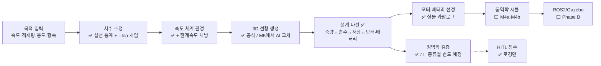

# 작업 현황도

> 갱신: 2026-07-27 (3차) · 테스트 134개 통과 · main 브랜치 기준
> 매 세션 시작할 때 이 파일부터.

## 지금 어디인가 (한 문장)

**Phase A 중반** — "목적 입력 → 실선 데이터 근거 치수 → 3D 선형 → 물리 검증 → 저항 → 실제 모터·배터리 선정(설계 나선 수렴)"까지 명령 한 줄로 동작. 오너 피드백 3건 반영 완료. 다음은 배를 움직이게 만들기(M4).

## 파이프라인 모듈 현황

✅ 동작 / 🔧 동작하지만 개편 예정 / ⬜ 미착수

## 완료된 마일스톤

| 마일스톤 | 내용 | 완료일 | 검증 |
|---|---|---|---|
| 설계 v1→v2 | 적대적 검토 13건 반영 (중량 모델 신설, 3체계 디스패처 등) | 07-24 | 스펙 부록 대응표 |
| M1 | 뼈대 + core 타입 + 디스패처 + 더미 로더 + HITL 로깅 | 07-24 | 테스트 |
| M2 | 중량·KG 추정 + 정역학 (평형 흘수 역산, GM 밴드) | 07-24 | 바지선 해석해 |
| M3 | Wigley 선형 생성 + 치수 추정 + E2E CLI | 07-24 | 부피 폐합, watertight |
| M3.5 | 저항 (ITTC-57 마찰 + Michell 조파) + 추력·파워 리포트 | 07-24 | Wigley 문헌 벤치마크 Cw=1.61e-3 |
| #15 속도 범위 | hull speed 양방향 (길이→속도 상한, 속도→최소 길이), 리포트·거절 메시지에 대안 숫자 | 07-26 | 역함수 왕복, classify 경계 일관성 |
| #14 데이터 기반 치수 | 실선 8척 수집(품질 점수·절대 등급·물리 관문) + 통계 밴드(단동 분리, 등급 가중) + --loa 사용자 개입 + 적재-크기 상호 제약 | 07-26 | 데이터 자체 pytest 고정, 루브릭 경계 |
| #16 모터 카탈로그 | 실존 스러스터 3종(T200·UL403·T500) 공식 스펙 → 여유율 2.0 차동 2발 최경량 이산 선택 | 07-26 | 선택 로직·거절 케이스 |
| #18 설계 나선 | 중량→흘수→저항→모터·배터리→중량 고정점 반복. 추진계 27kg 가정→4.5kg 실측, 전체 179→148kg | 07-26 | 수렴·중량 폐합·배터리 해석해 |
| M4a | 중량 분포모델(LCG·Izz·트림 경고, 오너 Q4) + Fossen 계수(Clarke 회귀 + 저항 미분 Xu, 외삽 경고, 직진안정 판별) | 07-26 | 수계산 고정값·차원 스케일·FD 대조 |
| M4b | Fossen 3DOF 시뮬 + LOS·PD·차동추력 — **배가 처음 움직임** (사각 코스 완주 167s). Clarke B/L=0.5 음수 관성 발산 버그 발견·수정(양수 클램프+플래그) | 07-26 | 물리 불변량 4종 + 완주 |
| #21 유도·제어 개편 | 잔물결 근본 규명(통통 선체 방향 불안정 → 한계 사이클) + lookahead LOS + 코너 감속 + **고유값 판별 게인 사다리**. 완주 142→62s, 직선 σ 0.71→0.05m. 직진안정 판별식 부호 오류 정정 | 07-27 | 선형화 안정 + 잔물결 회귀 테스트 |
| 스펙 v3 | M5 재편 (오너 결정 3건): NSGA-II 다목적 + 대리모델, HITL 쌍대비교 ELO, 설계공간 단계 확장. 확산모델 보류 | 07-27 | — |
| M5-ELO | 쌍대비교 ELO (이력 재생 파생, 제로섬·이변 가중) | 07-27 | ELO 성질 7종 |
| M5b-2 (1차) | NSGA-II 다목적 최적화 — Wigley 공간 × 물리 직접 평가. 첫 파레토 전선 24척 (저항 7~27N ↔ 중량 140~155kg) + ELO용 후보 STL 3종 | 07-27 | 비지배성·타당성·CLI |
| ELO 실전 | 오너 2라운드 평가 (경량형>안정형>저항형) — 시장 방향과 일치, 최적화기와 반대 신호. 렌더 종횡비 왜곡 발견·정정 | 07-27 | 이력 커밋 |
| M5a | Ship-D 연동 (오너 승인): 로더 + 45파라미터 재구성 + 상사 축소(scaled_mesh) + 우리 정역학 호환 실증 (20척: 통과9/GM탈락10/침수1/오류0) | 07-27 | skip-안전 테스트 |
| Michell 일반화 | 메쉬판 조파저항 (스캔라인 반폭 + 수치 이중적분) — Wigley 해석판 대비 0.3~0.6% 교차검증. Ship-D 적용은 문헌 미대조 (미검증 표시) | 07-27 | 해석판 5% 회귀 |

## 다음 작업 (합의된 순서, 2026-07-26)

| 순서 | 작업 | 유래 | 오너 참여 |
|---|---|---|---|
| ~~①~~ | ~~속도 실현가능 범위 함수~~ ✅ 07-26 완료 | 오너 제안 Q2 | 결과 피드백 |
| ~~②~~ | ~~치수 추정 데이터 기반 개편~~ ✅ 07-26 완료 (수집은 상시 지속: patrol/workboat 표본 0, 종류별 흘수·GM 밴드는 표본 확보 후) | 오너 제안 Q1·Q5 | 데이터 방침 승인함 |
| ~~③~~ | ~~모터 카탈로그~~ ✅ 07-26 완료 (설계 나선 #18까지) | 오너 제안 Q6 | 결과 확인 |
| ~~④~~ | ~~M4a — Fossen 계수 + 분포모델~~ ✅ 07-26 완료 | 스펙 | 개념 학습 |
| ~~⑤~~ | ~~M4b — 웨이포인트 시뮬~~ ✅ 07-26 완료 | 스펙 | 궤적 평가 |
| 이후 | M5a/b (Ship-D + AI 학습) → Phase B (ROS2) → Phase C (고속선·CFD) | 스펙 | |

## 결정 대기 (오너)

| 결정 | 시점 | 선택지 |
|---|---|---|
| ROS2 실행 환경 | M4b 완료 후 | Mac Docker (무료·중간 성능) vs 별도 Linux/클라우드 |
| Ship-D 데이터셋 다운로드 | M5a 착수 시 | 수백 MB, MIT 공개 |

## 오너 피드백 반영 이력

| 날짜 | 피드백 | 처리 |
|---|---|---|
| 07-26 | Q1 치수는 실선 데이터 기반 + 사용자 크기 선택으로 | 백로그 #14 |
| 07-26 | Q2 선형·치수별 속도 한계 함수 필요 | 백로그 #15 |
| 07-26 | Q4 무게중심은 분포하중 고려 영역 | M4a에 분포모델 승격 편입 |
| 07-26 | Q5 흘수·GM은 종류별 평균 범위로 판정 | #14에 병합 (물리 한계 + 통계 밴드 2층) |
| 07-26 | Q6 모터는 실제 카탈로그에서 선택 | 백로그 #16 |
| 07-26 | Q7 점수 평가자 신뢰도 우려 | 점수는 보조 신호 유지 + 루브릭 예정 |
| 07-26 | Q8 학부 2학년 수준 맞춤 소통 (전제조건) | 상호작용 계약으로 고정 |

## 알려진 한계 (정직 목록)

- 치수 통계는 단동 survey 3척 근거 — 표본 적음. patrol/workboat는 아직 개략값 fallback (#17)
- 배터리 에너지밀도·프로펠러 효율은 명명 상수 가정 (150 Wh/kg, 0.40)
- 선형은 공식(Wigley) — 선미 뾰족, 실제 USV 형상과 다름. M5에서 AI 교체
- Phase A는 저속 배수량형(Fn<0.4)만 — 고속 요청은 정직하게 거절함
- 무게중심은 점질량 3개 근사 — 트림·분포 미반영 (M4a에서 승격)
- Michell 저항은 실험 대비 과대예측 경향 — 자릿수 검증만 완료, 정밀 대조는 추후
