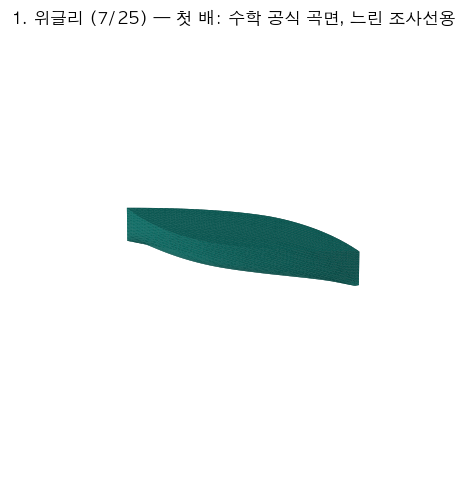
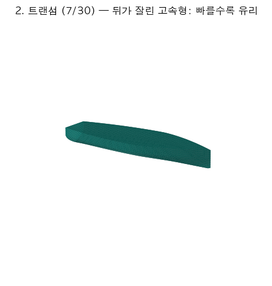
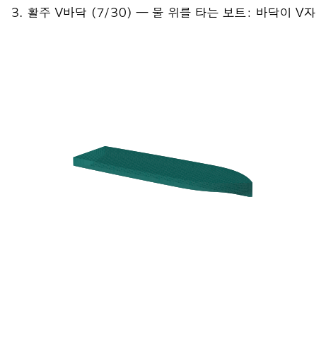

# 🚢 배를 설계하는 AI — 아주 쉬운 설명서

> **이 문서는**: 이 프로젝트를 처음 보는 사람(비전공자 포함)과, 프로젝트를 함께 만들었지만
> 전체 그림을 다시 보고 싶은 오너를 위한 설명서입니다.
> 전문용어는 나올 때마다 바로 옆에서 쉬운 말로 풀어 씁니다.
> **살아있는 문서**입니다 — 프로젝트가 자랄 때마다 같이 자라고, 오너가 직접 고치기도 합니다.
> (마지막 갱신: 2026-08-11 — 32일차: 빈 심판석에 심판을 세웠다)

---

## 목차

1. [한 문장 요약](#1-한-문장-요약)
2. [무엇을 만들었나 — 입력과 출력](#2-무엇을-만들었나--입력과-출력)
3. [시작된 계기](#3-시작된-계기)
4. [큰 그림 — 배 한 척이 설계되는 여정](#4-큰-그림--배-한-척이-설계되는-여정)
4½. [배 모양의 발전사 — 눈으로 보는 성장기](#4½-배-모양의-발전사--눈으로-보는-성장기)
5. [쉬운 용어 사전](#5-쉬운-용어-사전)
6. [여정 — 날짜별 이야기](#6-여정--날짜별-이야기)
7. [실패 박물관 — 사고와 배움](#7-실패-박물관--사고와-배움)
8. [우리가 지키는 원칙들](#8-우리가-지키는-원칙들)
9. [지금 어디까지 왔나](#9-지금-어디까지-왔나)
10. [직접 해보기](#10-직접-해보기)
10½. [옵시디언으로 읽기 — 연결 방법](#10½-옵시디언으로-읽기--연결-방법)
11. [기록은 어디에 있나](#11-기록은-어디에-있나)

---

## 1. 한 문장 요약

**"이런 배가 필요해요"라고 말하면, 컴퓨터가 물리 법칙으로 검증된 배 설계도를 만들어주고,
가상 바다에 띄워 스스로 항해까지 시켜보는 시스템**을 학부 2학년 학생과 AI가 열하루 동안 함께 만들었습니다.

## 2. 무엇을 만들었나 — 입력과 출력

**넣는 것 (3가지만)**:
- 용도 — 조사용? 순찰용? 작업용?
- 짐 무게 — 몇 kg 싣나요?
- 속도 — 얼마나 빨리? (모르면 생략 — 실제 배들 통계로 알아서 정함)

**나오는 것**:
- 3D 배 모형 파일 (컴퓨터로 돌려볼 수 있는 진짜 입체 도면)
- 검증 리포트 — 물에 뜨나? 뒤집히지 않나? 짐이 실제로 들어가나? 얼마나 세게 밀어야 그 속도가 나나?
- 실제 시장에서 파는 모터·배터리 추천 (상상의 부품이 아니라 실물 카탈로그에서 고름)
- 원하면: 가상 바다(로봇 시뮬레이터)에 띄워서 스스로 목표 지점들을 돌아오는 자율 항해 시연

**만들 수 없는 요청이면?** 거짓말로 만들지 않고 **이유와 대안 숫자를 들어 정직하게 거절**합니다.
(예: "이 크기로 그 속도는 물리적으로 무리 — 최소 4.2m는 되어야 합니다")

## 3. 시작된 계기

- 오너(조선해양공학 학부 2학년)가 AI에게 "목적 지향 선박 설계 파이프라인"이라는
  6단계 계획서를 받아왔습니다: ① 요구 입력 → ② AI가 배 모양 생성 → ③ 물리 검증 →
  ④ 로봇 시뮬레이터(ROS2/Gazebo) 연동 → ⑤ 정밀 유체해석(CFD) → ⑥ 사람 피드백으로 재학습.
- 첫날 한 일은 코딩이 아니라 **"이 계획이 말이 되는가?"를 뜯어보는 것**이었습니다.
  결론: 방향은 좋지만 연구 프로젝트 3개 분량 — 그래서 **단계를 잘라** Phase A(순수 물리)
  → B(시뮬레이터) → C(고속선·CFD)로 나눴습니다.
- 가장 중요한 약속(전제조건)은 기술이 아니라 **소통 방식**이었습니다:
  "나는 학부 2학년 — 용어를 정의해주고, 이해를 확인해주고, 왜 그렇게 하는지 설명해줘.
  코드만 쌓이고 내 이해가 안 따라오면 이 프로젝트는 실패야."

## 4. 큰 그림 — 배 한 척이 설계되는 여정

주문서 한 장이 배가 되기까지, 공장의 컨베이어 벨트처럼 단계를 지납니다:

```
[주문서]  용도 + 짐 무게 (+속도)
   ↓
[치수 결정]  실제 배들의 통계로 길이·폭·깊이를 정함
             ("조사선은 보통 길이가 폭의 몇 배" 같은 실측 비율)
   ↓
[속도 체계 판정]  이 속도면 물을 밀고 가는 배? 타고 달리는 배?
                  (셋 중 하나: 배수량형 / 반배수량형 / 활주형)
   ↓
[3D 모양 만들기]  수학 공식으로 매끈한 선체 곡면 생성
   ↓
[설계 나선]  무게 추정 → 얼마나 잠기나 → 물의 저항 → 필요한 모터·배터리
             → 그 무게를 다시 반영 → ... 답이 안 변할 때까지 뱅글뱅글
             (배터리가 무거워지면 배가 더 잠기고, 더 잠기면 저항이 늘고,
              저항이 늘면 배터리가 더 필요한 꼬리물기를 수렴시키는 것)
   ↓
[합격 검사 4종]  ① 무게만큼 정확히 뜨나  ② 기울여도 되돌아오나(복원력)
                 ③ 뱃전이 물 위로 충분히 나오나  ④ 짐이 공간에 실제로 들어가나
   ↓
[산출]  3D 파일 + 리포트 + 모터·배터리 추천
   ↓
[원하면 더]  가상 바다 자율 항해 (Gazebo) / 정밀 유체해석 (CFD) /
             수천 척 비교 최적화 (파레토) / "어느 배가 더 좋아요?" 클릭 투표 (ELO)
```

## 4½. 배 모양의 발전사 — 눈으로 보는 성장기

이 프로젝트가 만들 수 있는 배는 세 종류로 늘어왔습니다. 순서대로 보면
"느린 배 → 빠른 배 → 물 위를 나는 배"로 능력이 자란 이야기입니다.



**첫 배 (7/25)** — 위글리(Wigley)라는 100년 된 수학 공식으로 만든 매끈한 배.
앞뒤가 대칭인 날렵한 모양으로, 물을 **밀며** 천천히 가는 조사선용입니다.
"일단 수학으로 확실한 모양부터" 전략의 출발점.



**두 번째 배 (7/30)** — 뒤꽁무니가 뭉툭하게 잘린 모양(트랜섬)이 특징.
빠르게 달리면 물이 잘린 뒤에서 깔끔하게 떨어져 나가 오히려 저항이 줄어듭니다.
실제 고속 순찰선이 다 이렇게 생긴 이유. 느린 배가 빠른 영역으로 진출한 순간.



**세 번째 배 (7/30 심야)** — 바닥이 V자인 활주정. 충분히 빠르면 배가 물을
밀지 않고 **물 위로 올라타** 달립니다 (수상스키와 같은 원리). V자 바닥은
착수 충격을 부드럽게 하는 실전 설계. 이로써 세 속도 세계를 전부 커버.

이 셋에 더해, MIT가 공개한 **실제 배 모양 3만 척**(Ship-D)도 빌려 씁니다 —
공식 배는 매끈하지만 단조로운데, 실선 데이터는 진짜 배의 다양한 개성을
가르쳐 줍니다. (라이선스 규정상 그 모양 그림은 여기 싣지 않습니다 —
정직 원칙은 데이터 사용 규칙에도 적용됩니다.)

## 5. 쉬운 용어 사전

프로젝트에서 자주 나오는 말들. 여기만 읽어도 대화의 절반이 들립니다.

| 용어 | 쉬운 뜻 |
|---|---|
| **흘수 (draft)** | 배가 물에 잠기는 깊이. 짐을 실으면 깊어짐 |
| **아르키메데스 원리** | 배가 밀어낸 물의 무게 = 배의 무게. 그래서 무게를 알면 얼마나 잠길지 계산 가능 |
| **GM (복원력 지표)** | 기울었을 때 되돌아오려는 힘의 세기. 너무 작으면 뒤집히고, 너무 크면 멀미 나게 흔들림 — 그래서 "적당한 범위(밴드)"로 판정 |
| **Cb (방형계수)** | 배가 같은 크기 상자를 얼마나 꽉 채우나. 0.45면 날씬(빠름), 0.55면 뚱뚱(짐 많이) |
| **Froude 수 (Fn)** | 배의 "상대 속도". 같은 속도라도 작은 배에겐 빠르고 큰 배에겐 느림 — 이걸 공평하게 만든 숫자. 0.4를 넘으면 물리 법칙의 지배자가 바뀜 |
| **배수량형 / 반배수량형 / 활주형** | 물을 **밀고** 가는 배(저속) / 중간 / 물 위를 **타고** 달리는 보트(고속). 우리는 셋 다 설계 가능 |
| **조파저항** | 배가 만드는 파도에 뺏기는 에너지. 파도는 공짜가 아님 |
| **마찰저항** | 물이 선체 표면을 스치며 잡아끄는 힘 |
| **Michell 공식** | 조파저항을 빠르게 계산하는 100년 된 근사 공식. "배가 얇다"고 가정함 — 통통한 배에선 오차 발생 |
| **Savitsky 공식** | 활주 보트의 자세와 저항을 주는 1964년 경험 공식 (수많은 모형 실험의 요약) |
| **설계 나선** | 무게↔잠김↔저항↔모터가 서로 물고 도는 것을 답이 안 변할 때까지 반복하는 과정 |
| **파레토 최적** | "저항도 낮고 무게도 가볍고 안정성도 좋은" 만능 배는 없음 — 서로 트레이드오프인 후보들 중 "어느 쪽으로도 지지 않는" 최전선 후보들 |
| **ELO** | 체스 랭킹 방식. "둘 중 어느 배가 좋아요?" 클릭 대결을 쌓아 사람 취향의 순위를 매김 (1~5점 채점보다 신뢰성 높음) |
| **대리모델 (surrogate)** | 느린 물리 계산을 흉내 내도록 학습시킨 빠른 근사 AI — 3만 척을 몇 초에 훑을 때 사용 |
| **Ship-D** | MIT가 공개한 실제 배 모양 3만 척 데이터셋 |
| **ROS2 / Gazebo** | 로봇 운영체제 / 물리 법칙이 작동하는 가상 세계(시뮬레이터). 우리 배를 여기 띄워 자율 항해를 시험 |
| **CFD** | 물을 수십만 개 작은 칸으로 쪼개 유체 방정식을 직접 푸는 정밀 계산. 정확하지만 한 척에 몇 시간 |
| **격자 (grid)** | CFD가 물을 쪼개는 칸. 칸이 크면(거칠면) 작은 파도를 못 봄 — "눈금 굵은 자로 머리카락 재기" |
| **격자 수렴 연구** | 칸을 점점 잘게 쪼개며 같은 계산 반복 — 답이 안 변하면 믿고, 계속 변하면 아직 격자가 거친 것 |
| **능동 학습** | "다음 실험을 어디에 하면 가장 많이 배우나"를 데이터가 알려주는 학습 방식 |
| **MaxBox** | 선체 안에 들어가는 가장 큰 직육면체 = "짐 상자가 얼마나 크게 들어가나" |
| **민첩성 / 노모토 지표** | "얼마나 빨리 틀 수 있나". 오너가 대결 영상에서 발견한 4번째 기준 — 선회지름(배 길이의 몇 배 원을 그리나)과 반응 시간으로 잼. 결정: "충분하면 됨" → 합격 점수가 아니라 참고 표기 |
| **TDD (시험 주도 개발)** | 코드를 짜기 전에 "정답지(시험)"부터 만들고, 그걸 통과할 때까지 코드를 다듬는 개발 방식 |
| **watertight (물샐틈없는) 메쉬** | 구멍 없이 완전히 닫힌 3D 표면 — 구멍이 있으면 부피 계산이 다 틀어짐 |
| **R² (예측 성적표)** | AI의 예측이 얼마나 맞는지 점수. 1이면 만점, 0이면 "그냥 평균만 말하는 수준", 음수면 평균만 말하느니만 못함 |
| **과적합 (암기)** | 학생이 문제집을 너무 여러 번 돌면 원리 대신 답을 외워버려서 새 문제를 더 못 푸는 것 — AI도 똑같음 |
| **조기 종료** | 과적합 방지 장치: 연습 중 모의고사(검증) 점수가 정점을 찍고 내려가기 시작하면 그 시점에서 멈추고 최고점 상태로 되돌림 |
| **RTF (시뮬 배속)** | 시뮬레이터가 실제 시간보다 몇 배 빨리 도는지. 우리 가상 바다는 3배속 — 벽시계로 재면 모든 속도가 3배로 보이는 착시 발생 |
| **자기지속 루프** | 결과가 원인을 다시 키우는 악순환. 우리 배: 요동 → (방향 틀기 = 전진력) → 가속 → 더 큰 요동 |
| **격리 실험** | 통합 시스템에서 헤매지 말고 변수를 하나씩 떼어 측정하는 것 — 이 프로젝트 최고의 문제 해결 무기 (5시간 막힌 문제를 80초에 푼 전적) |
| **러더 (방향타)** | 배 뒤에 세운 판. 비스듬히 틀면 물이 옆으로 밀어줘 배가 돎. 추력(가는 힘)과 조타(트는 힘)를 분리하는 부품 — "자기 꼬리 먹는 배"의 진짜 해법 |
| **양력** | 흐르는 물(공기)이 비스듬한 판을 옆으로 미는 힘. 비행기 날개가 뜨는 원리와 동일. 속도의 **제곱**에 비례 — 그래서 정지한 배의 방향타는 무력 |
| **실속 (stall)** | 판을 너무 많이 틀면(약 17.5도 이상) 물흐름이 판에서 떨어져 나가 힘이 더 안 늘어나는 현상. 방향타에도 "유효 각도 범위"가 있음 |
| **서보** | 방향타를 명령한 각도로 돌려 잡아주는 작은 모터. 실물은 초당 375도로 빠름 |
| **트림** | 배가 앞뒤로 기우는 것 (좌우 기움은 힐). 짐을 뒤로 몰면 선미가 가라앉음 — 우리 검사 한계는 2도 |
| **LCB (부력중심)** | 물이 배를 떠받치는 힘의 앞뒤 중심점. 무게중심(LCG)이 이 위에 있어야 수평으로 뜸 — 어긋난 만큼 트림 발생. 저속 배는 앞쪽(선수 풍만), 고속 배는 뒤쪽 — 속도가 형태를 정함 |
| **구획 (bay)** | 칸막이로 나눈 짐칸. 실선은 짐을 한 덩어리가 아니라 여러 칸에 분산 적재 — 우리 공간 검사도 이 방식 (칸 수 상한 4) |
| **구간 판정** | 짐 배분에 따라 무게중심이 움직일 수 있는 범위(구간)를 계산해, 합격 범위와 겹치는지만 보는 판정법. 수백 가지 배치를 시험하는 대신 구간 2개의 겹침 검사로 끝 — "합격 배치가 존재하는가"에 수학적으로 확정 답 |
| **교차 검증 (시뮬)** | 우리가 만든 공식의 결론을, 우리가 안 만든 독립 도구(Gazebo 등)로 재확인하는 것. 순환 논증(내 공식으로 내 공식 검증)을 피하는 장치 |
| **Cm (중앙단면계수)** | 배 한가운데 단면이 직사각형에 얼마나 꽉 차는가 — 선저 풍만도의 손잡이. 낮으면 칼날 바닥, 높으면 실선처럼 둥근/평평한 바닥 |
| **round bilge / 하드차인** | 바닥과 옆구리가 만나는 방식: 둥글게(round bilge — 저속 표준, 내항성) vs 각지게(하드차인 — 활주정, 만들기 쉽고 덜 구름) |
| **run (선미 흐름부)** | 선미가 가늘어지며 물이 매끄럽게 빠져나가는 구간 — 저속 배 선미가 가는 이유 |
| **적재 처방** | "짐을 어디 실어야 배가 수평으로 뜨나"의 답 — 무게중심과 부심을 일치시키는 짐 위치 역산 |
| **내항성** | 파도 속에서 배가 얼마나 버티고 일하나 — 잔잔한 물 성적과 별개의 과목. 우리 다음 캠페인 |
| **RAO (응답진폭비)** | "파도 1 m가 오면 배는 몇 m 흔들리나"의 비율표 — 파도 주기마다 다름 (그네처럼 공명 주기가 있음) |
| **스트립 이론** | 배를 식빵처럼 얇게 썰어 단면마다 물의 반응을 계산하고 합치는 방법 — 파랑 응답 계산의 조선공학 표준 |
| **Lewis 사상** | 배 단면을 2개의 숫자(폭·풍만도)로 수학 곡선에 근사하는 고전 기법 — 반원을 넣으면 공식이 스스로 자신을 검증함 |
| **부가질량** | 배가 흔들릴 때 함께 끌려 움직이는 물의 질량 — 배는 제 몸무게보다 무겁게 흔들림 |

## 6. 여정 — 날짜별 이야기

### 7/24 (1일차) — 계획을 의심하는 날
코딩 대신 계획서 자체를 검증. "6단계 동시 추진은 무리"라는 결론으로 Phase 분할.
설계 문서를 쓰고, 적대적으로 다시 검토해 13가지 허점을 스스로 고침.
GitHub 공개 저장소 개설.

### 7/26 (2일차) — 오너의 질문 8개가 설계를 바꾼 날
오너가 던진 질문들(Q1~Q8)이 프로젝트의 뼈대를 다시 세움:
- "치수는 상상이 아니라 **실제 배 데이터** 기반으로 해야 하지 않나?" → 실선 통계 기반 치수로 개편
- "크기마다 낼 수 있는 **속도 한계**가 있지 않나?" → 한계속도 함수 (거절할 때 대안 숫자 제시)
- "무게중심은 **분포 하중**으로 봐야 하지 않나?" → 중량 분포 모델 승격
- "모터는 **실물 카탈로그**에서 골라야 하지 않나?" → Blue Robotics 등 실제 제품 선택 모듈
- 그리고 전제조건: **"용어 설명·이해 확인·왜 설명을 계속 해달라"** — 이 문서가 존재하는 이유
데이터 품질 등급제(오너 설계)와 "매 세션 작업일지" 관례도 이날 시작.

### 7/27 (3일차) — 검증 문화가 자리 잡은 날
- 오너의 강한 추궁("궤적이 왜 저래? 시뮬을 정확히 알고 만든 거냐")이 대개선을 촉발:
  수학 분석(고유값)으로 "짧뚱한 배는 원래 직진을 못 한다"를 규명하고 제어기를 다시 설계 — 요동 14배 감소
- 점수 채점을 버리고 **쌍대비교 ELO**로 교체 (오너 제안), 다목적 파레토 채택
- MIT Ship-D 3만 척 다운로드 승인 — "실제 배 모양"의 세계로
- 외부 AI(Gemini)의 그럴듯한 분석이 절반 틀렸음을 실물 검증으로 적발 — 내 렌더링 왜곡도 자백·정정

### 7/28 (4일차) — 외부 AI를 다루는 법을 배운 날
- 외부 AI에게 검토를 시킬 때의 **가드레일 프롬프트** 설계 (맥락 완비 + 한계 선공개)
- 외부 AI가 만든 HTML 설명서 검수: 숫자 날조 0건(가드레일 성공), 왜곡 2건 정정,
  **없던 결정을 창작**한 것 적발 — 단 그 아이디어(MaxBox)는 살려서 나중에 정식 논의(→ 7/31 완결)
- 실행 환경 확정: Mac Docker로 시작, 나중에 Windows 고성능 PC를 Linux 머신으로 추가 가능

### 7/29 (5일차) — Gazebo와 싸운 날
가상 바다에 배를 띄우는 게 이렇게 험난할 줄은:
배가 우주로 발사되고(부력 설정 함정), 좁은 상자배가 뒤집히고(복원력 폭³ 법칙 — 오너가 원리를 정확히 답함),
가짜 "안정 부양"에 속을 뻔하고(물리 엔진이 조용히 죽어 있었음).
바지선 부력을 이론값과 0.1mm까지 맞추는 교차 검증으로 신뢰를 회복.
**피드백 기록지**(이 문서의 원재료)도 이날 오너 요청으로 탄생.

### 7/30 (6일차) — 완주의 날
- 오전: 격리 실험 80초로 어제 5시간 막힌 문제의 진범 확정 (음수 추력 = 엔진 조용한 고장).
  **가상 바다 사각 코스 자율 완주** — 설계→검증→최적화→시뮬레이션 전 사슬 첫 통합 실증
- 저녁: "왜 지그재그로 가?"(오너 관찰) → 게인 재조정으로 흔들림 7배 감소.
  반배수량형(트랜섬 선미) 개방, 이어서 **활주형(Savitsky)까지 — 세 속도 체계 전부 설계 가능**.
  활주정은 원래 뻣뻣하다는 물리(얕은 잠김 → 복원력 과잉)를 밴드 완화로 반영

### 7/31 (7일차) — 원안 완성, 그리고 겸손을 배운 날
- **CFD 훅 완성** — 원안 6단계의 마지막 조각. 설계 산출물이 자동으로 정밀 해석 케이스가 되고
  결과가 라벨로 쌓임. 가상 수조가 침수되는 버그를 힘의 시간 기록 분석으로 잡음
- "Michell이 통통배에서 5배 과대예측" 발견 → **능동 학습 1회전**: 배 4척의 CFD로 보정 공식을
  적합하려 했으나 **데이터가 직선 가설을 기각** — 원인은 거친 격자가 작은 파도를 잡아먹은 것
- **격자 수렴 연구**로 확증: 격자를 조이니 값이 크게 움직임 (아직 미수렴 — 더 조이는 중)
- **MaxBox 공간 검사** 완결 (오너 결정: "용도는 사용자의 마음, 우리는 구현 가능성 판단")
- 오늘의 최대 교훈: **"CFD가 공식과 다르다고 공식이 틀린 게 아니다 — 먼저 격자부터 의심하라"**
- 이날 밤 실선 데이터도 확충: 순찰정 3척 추가 + L30 제원 오류를 공식 PDF로 정정
  → patrol 통계가 실측 기반으로 전환

### 8/1 (8일차) — 측정의 한계를 인정한 날
격자를 세 방식(1.5배, 2배, 수면 띠만 촘촘)으로 조여가며 "Michell 공식이 얼마나 틀리나"를
재려 했지만, 답이 격자 배치에 따라 0.2~0.4 사이를 오감 — 격자가 아니라 **재는 방법 자체의
정밀도 바닥**에 닿았다는 결론. "Michell이 통통한 배에서 과대예측한다"는 방향은 모든 격자에서
일관되게 확인됐지만, "몇 배"라는 숫자는 미확정으로 남기고 캠페인을 정직하게 종료.
16번의 CFD 실행이 가르친 것: **수렴 연구는 도구의 한계뿐 아니라 방법의 한계도 드러낸다.**

같은 날 밤, AI(대리모델)의 재교육도 대반전: 어제 성적이 "동전 던지기 수준"(가짜 100% 성적의
진실)이었는데, 입력을 원시 좌표 45개에서 **물리가 아는 요약 30개**(부피, 날씬비, 물 가르는
각도, 평형 잠김 깊이 등)로 바꾸자 성적이 급등 — "AI 성능은 모델보다 **무엇을 보여주느냐**가
먼저"라는 머신러닝의 격언이 배 데이터에서 그대로 재현. 덤으로 "최적화의 저주"도 관측:
예측이 좋아질수록 AI가 극단적 후보(모델이 가장 틀리기 쉬운 가장자리)를 노려서, 재검증
통과율은 오히려 떨어짐 — 잘 아는 것과 잘 고르는 것은 다른 문제.

### 8/1 밤~8/2 (9~10일차) — 오너의 눈이 지뢰 두 개를 캔 날
- **용도 추천 완성**: "조사용이면 안정 중시" 같은 기본 가중에 오너의 클릭 취향(ELO)이
  섞여 파레토 후보 중 ★ 추천 1척을 자동 표시 — 클릭이 쌓일수록 사람 취향이 주도권을 가짐
- **활주정을 가상 바다에**: 새 배(강한 모터)가 옛 코드의 숨은 가정을 시험 — 빠른 배가
  목표 지점을 스치면 유도 장치가 경로를 무한 연장해 **1,265m 직진 폭주**하는 잠복 버그 발굴·수리
- **대결 방식 개편 (오너 제안)**: "차이를 모르겠다 — 3D와 주행 영상으로 보여달라" →
  회전 3D + 저항 화살표가 보이는 주행 비교 GIF로 교체. 그리고 오너의 판정 이유 한 줄
  ("저저항은 목표도 못 가")을 검증하다가 **최대 지뢰 발굴**: 극저속에서 저항 공식이
  쓰레기값(107N)을 뱉어 배가 '가짜 평형'에 갇혀 있었음 — 첫 시뮬(7/26)부터 잠복하던 것
- **새 발견 — 민첩성**: 오너의 최종 판정 이유 "목표 방향으로 빠르게 틀어서 도착"은
  우리 3목적(저항·중량·안정) 어디에도 없는 **네 번째 기준 후보** — 사람의 눈은 시스템이
  측정하지 않는 것을 본다. 이것이 사람-참여(HITL)의 존재 이유

### 8/3 (11일차) — 세계를 정직하게 만든 날
가상 바다의 배가 코너마다 폭주하던 문제를 사흘에 걸친 3막 수사로 종결:
- **1막 (격리 실험)**: 배를 홀로 띄워 가속·관성 항주·선회를 따로 측정 — 가상 바다는
  "시킨 대로만" 움직이고 있었음이 입증 (결백). 진범은 우리가 내보낸 저항 공식:
  "속도에 정비례" 직선 하나라, 과속 영역에서 물이 실제보다 훨씬 미끄러웠던 것.
  덤: 헤드리스 시뮬은 실시간의 3배속으로 돎 — 벽시계로 재면 25 m/s라는 착시 (실측 함정)
- **2막 (수술)**: 저항을 "속도 제곱" 중심으로 교체 — 활주정 이론상 최고속도가
  18.8 → 6.6 m/s로 현실화. 부양 정확도는 그대로임을 5단 검증 사다리로 확인
- **3막 (재튜닝)**: 7가지 게인 조합 스윕 — 옛 축소 스케일은 미끄러운 세계용
  '붕대'였고, **정직한 세계에선 원래 수학(고유값 설계)이 그대로 정답**이었음.
  세계가 거짓말을 하면 옳은 제어도 붕대를 감아야 했던 것
- **마지막 발견 — 자기 꼬리를 먹는 배**: 좌우 추력 차이로 방향을 트는 배는
  트는 행위 자체가 전진력이 됨 (후진 불가라서) → 요동이 가속을 낳고 가속이 요동을
  낳는 자기지속 루프. 배분 공식 재설계 2가지를 시도했지만 둘 다 계측상 악화 —
  **구조적 한계로 정직하게 인정** (진짜 해법은 방향타 추가 같은 하드웨어 층)

### 8/3 (12일차) — 방향타가 태어나고, 짐칸이 진짜가 된 날

하루에 캠페인 두 개가 완결된 가장 긴 날입니다.

**이야기 1 — 조타와 추력의 이혼 (방향타 캠페인)**

어제 발견한 "자기 꼬리를 먹는 배" 문제, 기억하시나요? 좌우 모터 세기
차이로 방향을 트는 배는 방향을 트는 행위 자체가 앞으로 미는 힘이라,
느리게 가라는 명령을 구조적으로 못 듣습니다. 소프트웨어로는 못 고친다고
정직하게 인정했었죠. 오늘 그 진짜 해법을 달았습니다 — **방향타(러더)**.

방향타는 물살 속에 세운 판입니다. 판을 비스듬히 틀면 물이 판을 옆으로
밀어요 (비행기 날개가 뜨는 것과 같은 원리 — **양력**). 핵심 성질은
"물살이 없으면 힘도 없다": 힘이 속도의 제곱에 비례해서, 정지한 배에선
방향타가 무력합니다. 그래서 우리 배는 두 방식을 다 갖췄습니다 —
순항 중엔 방향타(추력 오염 없음), 저속·정지 근처에선 모터 차이가 보조.

과정이 4단계 대장정이었습니다:
1. **가설 검증**: 파이썬 시뮬에서 "차동은 폭주, 방향타는 추종" 입증.
   반전 하나 — 폭주의 숨은 전제가 "모터는 후진 불가"라는 조건이었음을
   이때 처음 알았습니다 (우리 시뮬은 후진을 허용해서 재현조차 안 됐던 것)
2. **정식 옵션화**: 조타 방식을 골라 끼우는 스위치(--steering)와
   구성별 성적표 자동 생성기
3. **실물 스펙 수집**: 방향타 공식·크기·서보(방향타 돌리는 모터)를
   전부 논문·제조사 실측값으로 교체. 여기서 큰 발견 — 우리가 어림잡았던
   방향타 힘이 실제보다 3.5배 후했고, 규정(DNV) 최소 크기로는 둔한
   배를 못 잡아서 "필요한 힘을 역산해 크기를 정하는" 실선 설계법을
   그대로 재발견했습니다. 느린 배일수록 큰 방향타가 필요합니다
   (힘이 속도 제곱이라, 느리면 면적으로 벌충해야 하니까요)
4. **독립 재판관 검증**: 우리가 안 만든 물리 엔진(Gazebo)에 방향타를
   달아 같은 실험 — 결과 재현. 우리 공식이 우리 공식을 검증하는 순환이
   아니라, 남의 계산기로도 같은 답이 나온 겁니다

최종 성적 (가상 바다, 참고용): 느리게 가라는 명령(0.77)에 차동 배는
빠른 배 기준 4배까지 폭주, 방향타 배는 0.68로 순종. 결론 — **저속
운용이 필요하면 방향타는 선택이 아니라 필수**.

**이야기 2 — 짐칸이 진짜가 된 날 (다구획 캠페인, 오너 발상)**

지금까지 "짐이 들어가나" 검사는 배 속에 큰 상자 하나를 넣어보는
방식이었는데, 실제 배 모양(뾰족한 머리, 굽은 옆구리)에는 너무
가혹해서 검사를 꺼둔 상태였습니다. 오너가 방향을 제시했습니다 —
"**각 배마다 실제 적재 공간을 먼저 만들고, 그 안에서 상자 여러 개를
자유롭게 채우면 확실한 부피와 무게가 나온다**." 이 한 문장이 설계의
뼈대가 됐습니다:

1. **적재 공간 만들기**: 모터·배터리가 차지할 자리(실측 배터리
   밀도로 계산)를 선미에서 먼저 빼고, 남은 곳이 화물칸
2. **여러 칸에 나눠 싣기**: 실선처럼 칸막이로 나눠 (앞칸/뒷칸...)
   각 칸에 상자를 채움. 너무 작은 "종잇장 상자"는 짐이 실제로 못
   들어가니 금지, 칸 수도 4개까지 (3m 보트에 9칸은 비현실이라)
3. **무게와 균형까지**: 짐을 어느 칸에 얼마씩 두느냐에 따라 배의
   무게중심이 움직이는데, 그 움직일 수 있는 범위를 수학으로 바로
   계산해서 "안 뒤집히고(GM) 안 곤두박질치는(트림) 배치가 존재하는가"를
   확정 판정합니다. 짐을 뒤로 몰 수밖에 없는 배가 14도까지 기우는
   "곤두박질형"을 처음 걸러냈습니다

결과: 실선형 3만 척 선별기가 다시 열렸고, 검사가 4중 게이트(무게·
공간·균형·트림)가 됐습니다. 표본 100척 기준 52~68척이 전부 통과.

**이야기 3 — 데이터 적립의 졸업식**

배 라벨을 6,500장에서 1만 장으로 늘려 AI를 재교육했습니다. 시험
점수(R²)는 거의 안 올랐어요 — 데이터를 더 부어도 안 느는 "수확
체감"이 확정된 겁니다. 그런데 실전 지표(AI가 합격이라 한 배를 실제
검사했을 때 진짜 합격인 비율)는 55%→77%로 뛰었습니다. 점수는 멈췄지만
합격선은 정교해진 것. 다음 지렛대는 데이터 양이 아니라 **특징 v3**
(AI에게 보여주는 요약 정보의 질)로 확정됐습니다.

**결정 하나**: 사람이 직접 고르는 ELO 대결은 시뮬 작업이 다 끝난
뒤로 미루기로 (오너 결정). 사람 시간은 이 프로젝트에서 제일 귀한
자원이라, 볼거리가 다 쌓인 뒤 몰아 보는 게 대결 한 번의 가치가
최대가 되기 때문입니다.

### 8/3 심야 ~ 8/4 (13일차) — 함대가 뒤집혀 있었다는 걸 안 날

가장 충격적인 발견과 가장 부끄러운 오진이 연달아 온 이틀입니다.

**발견 — 가상 바다의 배는 전부 뒤집혀 있었다**

가상 바다에서 배가 이유 없이 한쪽으로 흐르는 문제를 파다가, 변수를
하나씩 떼는 격리 실험 사슬(모형 대칭? 무죄 → 방향타? 무죄 → 추력?
무죄)이 끝에서 캐낸 것: **추력 0으로 가만히 둬도 배가 5~15초 만에
스스로 뒤집히고, 뒤집힌 자세로 안정**. 그동안의 가상 바다 완주
기록들은 뒤집힌 배가 세운 것이었습니다 (추진기와 저항 장치는 자세를
안 가려서 완주 자체는 됐던 것).

원인: 가상 바다의 부력 계산이 "기울면 물에 잠긴 모양이 바뀌어서
배를 되세우는 힘이 생긴다"(메타센터 복원 — 배가 안 뒤집히는 바로 그
원리)를 재현하지 못함. 손계산으로는 튼튼하게 안정(GM +0.56)인 배가
가상 바다에서는 도립 진자였던 겁니다.

처방이 우아합니다: 부력 계산용 상자를 **4×3 조각으로 쪼개기** —
배가 기울면 기운 쪽 조각이 더 잠기고 반대쪽이 덜 잠겨, 부력 중심이
이동하는 걸 조각 단위로 재현. 60초 완전 직립, 완치.

**오진의 해부 — 내가 만든 유령 두 마리**

직립시킨 뒤 방향타 배가 갑자기 길을 잃었습니다. 하루 동안 "저속에서
부호가 뒤집히는 아티팩트"와 "실속 밖 양력 반전"이라는 진단 두 개를
내렸는데 — **둘 다 내 측정 실수가 만든 유령**이었습니다. 스텝 실험
판정을 "40초 후 각도 한 점"으로 읽었는데, 각도는 ±180°에서 한 바퀴
돌면 되감기니(wrap) −248° 회전을 +112°로 오독한 것. 각속도
시계열(매 순간의 회전 속도)로 다시 읽으니 전모는 단순했습니다:
가상 바다의 방향타는 부호가 우리 규약과 반대일 뿐, 아티팩트는 없음.

정정 후 최종 성적 (직립 정직 세계, 조사선): 방향타 배 코스 완주
σ2.52 (차동과 동급), **저속 명령 0.77에 0.73으로 순종** (차동은
1.61 폭주) — 방향타 결론이 남의 물리 엔진에서 재확정됐습니다.

덤 수확: 뒤집힌 배에서 잰 옛 조종 캘리브레이션(부호 반전)도 정체가
드러나 원복 — "배가 뒤집히면 왼쪽·오른쪽도 뒤집힌다"는 당연한
사실이 원인이었습니다.

### 8/4 오후 ~ 8/5 (14일차) — 오너의 눈이 배를 실제 배로 만든 날

ELO 대결을 재개하려던 날이었는데, 오너의 관찰 세 방이 연달아 설계를
바꿨습니다.

**관찰 1 — "배 밑부분이 없는 것 같다"**: 확인하니 우리 수학
선형(Wigley)의 바닥이 칼날처럼 수렴하고 있었습니다. Ship-D 실선형
300척의 바닥 폭을 재서 (10% 높이 폭비율 0.25/0.44/0.68 분위) 용도별
선저를 캘리브레이션: 조사선 = 둥근 빌지(중앙값), 작업선 = 풍만
바닥(75분위), 활주정은 V바닥 15°가 문헌 표준임을 확인해 근거만 승격.

**관찰 2 — "바꿨다는데 그대로인데?"**: 물리와 최적화는 새 바닥으로
돌았는데 **그림 그리는 경로만** 옛 값으로 배를 그리고 있었습니다
(배선 7곳 중 1곳 누락). 게다가 회전 영상은 위에서 내려보는 시점이라
바닥 차이가 원래 안 보이는 매체 — 단면 겹침 비교 그림을 새 판정
재료로 도입했습니다.

**관찰 3 — "선수와 선미가 왜 똑같아?"**: 정답. Wigley는 수학상 앞뒤
거울 대칭 — 검증용 시험 선형의 잔재였습니다. 오너 결정("바꾼 걸
메인으로")으로 **선수미 비대칭이 기본 선형으로 승격**:
- 근거가 반전을 담고 있습니다 — 저속 배는 통념과 달리 **선수가
  풍만하고 선미가 가늘어야** 해요 (물이 뒤에서 매끄럽게 빠지는 게
  우선). Ship-D 3만 척의 부심 위치 실측(중앙값 선수쪽 2.3%)과
  문헌이 일치
- 대칭 Wigley는 버리지 않고 "표준기"(정밀 검증용 자)로 보존

**비대칭이 낳은 두 가지 덤**:
1. 설계 나선의 저항 계산이 옛 세계 수식을 쓰던 **혼합 세계 구멍**
   발견 — 수리하고 최적화 전선을 정합판으로 재생성
2. 부심이 앞으로 가니 배가 **3도 곤두박질**로 뜨려 했습니다 — 실선
   방식 그대로 "짐을 어디 실을지"를 역산해 수평(0.0도)으로: 이제
   설계 리포트가 **"짐은 중앙에서 4.8% 앞에 실으세요"**라는 적재
   처방까지 알려줍니다

**ELO도 오너 손에 다듬어졌습니다**: 극단끼리 대결 기각("비교
불능") → 비슷한 형태끼리 매칭으로 재설계, 무승부 정식 지원 (첫
무승부가 "이 정도 차이는 구분 불가"라는 문턱 데이터가 됨), 주행
영상 20초·전체 화면·배속 자막, 선회 영상의 불공정 진입(종단속도
8.6배 폭주 진입) 발굴·수리. 기록 파일 형식 충돌(4열↔5열) 사고도
하나 잡았습니다.

### 8/5 오후~야간 (15일차) — 실선 45개 손잡이가 주전이 된 날

오너가 실선급 선도(설계 도면) 이미지를 보여주며 "이 수준이 나올 수
있나?"라 물었고, 답은 **생성기 교체 캠페인**이 되었습니다. 우리 수식
배의 손잡이는 3개(Cb·Cm·부심)뿐인데, MIT 실선 데이터(Ship-D)의 배는
**45개 손잡이**(선수 9·선미 11·벌브 14…)로 만들어져 있거든요. 하루
동안 4단계를 완주했습니다:

1. **생성 경로 개통**: 45개 숫자 → 3D 배 → 검사 4종 관통. 데모의
   "느낌이 다르다"(오너)는 결함이 아니라 혈통 차이였음을 실측
   (평행한 중앙 몸통 50% vs 3% — 상선과 시험 선형의 차이)
2. **조건이 배 모양을 고르게**: "빠른 배엔 활주 문법, 화물선엔 대형
   문법"(오너 철학)을 규칙 한 줄 없이 구현 — 조건(짐·속도)으로 실측
   선별하면 무거운 조건은 통통한 배를, 빠른 조건은 날씬한 배를
   **스스로** 뽑습니다 (역전 지점까지 실측: Fn 0.24~0.33 사이)
3. **최적화 대결**: 45개 전부 열면 자식 배 66%가 규칙 위반으로
   죽어 참패 (정직 기록). "실선의 앞뒤를 빌리고 몸통 비율만 다시
   재단"하는 부분 개방으로 재도전 → **기존 수식 최전선에 12승 0패**
   (같은 저항에 10 kg 가벼움)
4. **주전 교체는 실측 심판으로**: 그런데 빠른 선별을 그냥 기본값으로
   올렸더니 저항 6.5배 배가 뽑히는 함정 발견 — 이제 파이프라인은
   실선 후보와 수식 배를 **그 자리에서 실측 대결**시켜 이긴 쪽만
   채택합니다 (판정 사유가 리포트에 남음). 수식 배는 은퇴가 아니라
   심판으로 승진.

이날의 사고 하나는 박물관 31호(🚧 가짜 전멸)가 되었습니다 — 컴퓨터
권한 사고가 "물리 법칙의 벽"처럼 위장했던 이야기.

### 8/6 (16일차) — 예산이 뒤집은 판정, 그리고 "크기는 손님의 것"

**최적화 재대결**: 어제 "45개 손잡이 전부 열면 진다"고 기록했는데,
계산 예산을 6.7배로 올려 재대결하니 **전차원이 부분공간마저 18승
2패로 추월**했습니다. 어제의 패배는 차원의 저주가 아니라 예산
부족이었던 것 — 판정을 정직하게 뒤집어 기록했습니다. 이제 시간
예산에 따라 고르는 3계층 사다리가 섰습니다: 1분(빠른 선별) /
10분(부분 개방) / 35분(전부 개방, 최강).

**순찰정 바닥 마무리**: 어제 "기록만" 해뒀던 순찰정 선저 풍만도
(실측 0.80)를 실제로 배선 — 하다가 함정 발견: 순찰정처럼 날씬한
배에 풍만한 바닥을 그대로 걸면 기하학이 거부해 **설계 전부가
거절되는** 조합이었습니다. "도달 가능한 최대치까지 + 사유 표기"라는
정직 클램프로 해결.

**크기 원칙 (오너)**: "크기는 사용자들이 선택하는 것 — 우리가
결정하는 게 아니다." 지금까지 소형 무인선에 초점이 맞아 있던 건
공식 스펙이 잘 공개되는 시장이 거기였기 때문일 뿐, 설계 제약이
아니었습니다. 데이터 수집부터 크기 제한을 풀었고, 대형 배로 가는
길의 병목(추진계 카탈로그·구조 중량 법칙)을 로드맵으로 등록.
좋은 소식: 물리 심장부는 크기를 가리지 않아서 — 벽은 데이터에만
있고, **수집이 곧 개방**입니다.

라이선스 문의는 초안까지 썼다가 오너 판단으로 철회 ("개인 사용이라
불필요" — 맞는 판단, 생성 형상 비공개 규칙은 유지). 외부 AI로
자료를 모을 때 쓰는 수집 프롬프트도 만들었습니다 — AI가 스펙을
지어내지 못하게 하는 3중 장치(빈칸 강제·출처 필수·직접 검증)를
내장한 버전.

**그리고 그날 저녁, 원칙이 배가 되었습니다** — 전 크기 개방 캠페인
4단계 완주:

1. **저항의 교체 선수**: 상선처럼 통통한 배에서는 우리의 Michell
   공식(배가 얇다고 가정)이 조파저항을 수십~수백 배 과대평가함을
   실측으로 확인 — 조선소 실무 표준인 Holtrop 공식을 구현하고,
   국제 공개 벤치마크 배(KCS 컨테이너선 수조 실측)와 대조해
   오차(+13.6%, 문헌 보고 경향과 일치)까지 박제했습니다.
2. **강선의 무게 법칙**: 수 미터급 회귀 대신 Watson 공식(조선
   교과서 표준)으로 구조·의장·기관을 나눠 추정 — 230 m급에서
   자릿수 검증.
3. **프로펠러가 진짜로 설계됨**: 바헤닝언 B-시리즈(120개 모형
   수조시험의 회귀 공식)를 공개 계수로 확보 — 재미있는 사건: 내
   기억 속 도표값으로 쓴 검증 시험이 틀렸고, 진짜 계수가 그걸
   바로잡았습니다 ("기억 대신 데이터" 원칙의 실증). 직경·피치·
   회전수를 골라주고 캐비테이션(기포 발생)까지 검사합니다.
4. **한 줄 명령의 화물선**: "짐 5,000톤, 화물선" → 길이 98.9 m,
   경하 2,085 t, 저항 208 kN, 프로펠러 D 4.15 m·124 rpm, 엔진
   4 MW, 국제 규정(IMO 복원성·ICLL 건현) 게이트 합격 — 모든
   숫자가 실제 그 급 화물선과 자릿수 일치. 소형 무인정과 100 m
   화물선이 **같은 조립 라인**에서 나옵니다.

숨기지 않는 것: 무게중심 추정과 엔진 목록은 아직 개략(C급)이라
리포트에 "⚠미검증" 딱지가 그대로 찍혀 나옵니다 — 다음 수집·검증
회차의 몫.

### 8/7 (17일차) — ELO의 은퇴식, 그리고 화물선의 정밀화

**ELO 보류 (오너의 구조적 통찰)**: 새 최강 함대(60척)로 클릭 대결을
재개하려는 순간, 오너가 근본 질문을 던졌습니다 — "용도가 조건을
정하고 조건이 배 모양을 정하는 체계라면, 같은 용도 안에서 사람에게
또 고르라는 건 이중 질문 아닌가?" 검토 결과 타당했습니다. 시스템이
자라면서 (용도별 가중 → 조건부 선별 → 실측 맞대결) 사람 클릭이
알려줄 수 있는 정보가 줄어든 것. 기능은 지우지 않고 보존한 채
보류 — 실사용자가 생기면 그때 다시.

**화물선의 C급 딱지 떼기**: 어제 첫 화물선 설계에 붙어 있던 "개략"
딱지들이 하나씩 실물로 교체됐습니다 — ① 가상 엔진 → 실물 3종
(Wärtsilä 2종 + MAN 저속디젤, 696쪽 제조사 설계 가이드에서 건조질량
278톤을 직접 캐냄) ② 물맴돌이(반류) 고정 가정 → 배 모양 연동
정밀식 (검증 문헌 3종 교차 표기된 공개 구현에서 이식) ③ 무게중심
한 줄 가정 → 5성분 분해. ④ 덤: MIT 실선 3만 척을 100 m로 키워
우리 화물선과 맞대결시키는 접속까지 — 첫 판정은 "수식 승" (실척
후보가 종합 1.22배 열세 — 심판이 정직하게 일함).

유료 문헌 벽에 막힌 것 하나(두 번째 벤치마크 배 실측값)는 지어내지
않고 "미확보"로 기록 — 우리 원칙 그대로.

**수집 대회전**: 오너가 외부 AI로 모아온 자료 + 제가 직접 웹에서
캐온 자료를 같은 잣대(공식 출처만·URL 직접 확인·빈칸 강제)로
검수했습니다. 결과: 실선 6척 추가(첫 소형 쌍동 BlueBoat 포함, 총
16척), 실물 엔진 2종 추가(A급 4종 체제). 품질 검증기가 제몫을 톡톡히
했습니다 — 속도 없는 배 거부, 곤돌라 포함 흘수 격리, 그리고 외부
AI가 2차 답변에서 "더 안전하게 한다며" 출처 URL을 지운 채 새 숫자를
내놨을 때(그중 하나는 우리가 직접 잰 실측과 충돌 — 환각의 현장
검거) 전량 반려. 교훈: **출처 링크는 검증의 손잡이 — 지우는 게
아니라 우리가 직접 여는 것.**

**그리고 파도가 시작됐습니다**: 다음 큰 캠페인으로 파랑·내항성
(배가 파도에서 얼마나 버티나 — 조선공학의 심장부)을 오너와 함께
설계했습니다. 지름길(근사식) 대신 정통(스트립 이론)을 선택 —
프로펠러 때와 같은 결. 첫 벽돌 두 장을 놓았습니다: 배 단면을 수학
곡선으로 근사하는 Lewis 사상(반원을 넣으면 공식이 스스로 자신을
증명하는 성질로 검증), 그리고 배 전체를 단면 목록으로 썰어내는
추출기(중앙 단면 풍만도가 설계값과 일치하는지로 검증). 세 번째
벽돌로 배가 좌우로 흔들리는 고유 리듬(횡요 주기)을 국제 규정(IMO)
공식으로 계산해 리포트에 실었습니다 — 우리 100 m 화물선은 14.9초
(실제 그 급 상선과 일치). 파도의 리듬과 배의 리듬이 겹치면(공명)
위험한데, 그 판정의 기초석입니다. 다음 벽돌 "파도를 만들며 잃는
에너지"는 원전 문헌을 확보한 뒤에 (기억으로 공식을 쓰지 않는 원칙).

### 8/8~8/9 (18~19일차) — 파도의 수학이 완성된 이틀

**원전을 찾는 추적기**: 파도 계산의 교과서(SEAWAY 이론 매뉴얼)를
찾아 나섰다가 — 미러 사이트 전멸, 원저자 홈페이지는 도메인까지
소멸. 우회로: 같은 저자의 TU Delft 공개 교재(570쪽)를 확보해 필요한
수식 전부를 페이지 번호까지 지도로 만들었습니다. "기억으로 공식을
쓰지 않는다" 원칙의 대장정.

**벽돌이 쌓인 순서** (각각 해석 앵커로 검증):
1. **Ursell 반원**: 흔들리는 반원이 물을 얼마나 끌고 다니고 파도로
   얼마나 에너지를 잃는지 — 에너지 보존 항등식이 소수점 셋째
   자리까지 맞아떨어짐 (비 1.000)
2. **Frank 임의 단면**: 어떤 단면이든 계산 — 완전히 다른 두 수학이
   같은 답(1~2%)을 내는 이중검증. 격리 실험이 사고 2건을 검거
   (수식의 실수부 구조·압력이 미는 방향)
3. **배 전체의 응답 (RAO)**: 단면들을 합쳐 — 긴 파도에선 배가
   파면을 그대로 타고(계산값 0.997, 이론값 1), 짧은 파도는 상쇄되어
   사라짐. 교과서 곡선 그대로
4. **바다의 통계**: 실제 바다는 한 파장이 아니라 스펙트럼 —
   "유의파고 3.5 m 바다에서 이 배는 평균적으로 얼마나 흔들리나"
5. **다섯 번째 관문**: 뜨나·안 뒤집히나·짐 들어가나·수평인가에
   이어 — **"이 파도에서 일할 수 있나"**

**첫 판정이 던진 교훈**: 우리 2 m 조사선은 잔잔한 연안(파고 0.5 m)
에서도 옆흔들림 28.5° — 불합격. 지금까지 4개 관문을 다 통과하던
배가 다섯 번째에서 떨어졌습니다. "물에 뜨는 배"와 "파도에서 일하는
배"는 다른 질문이었던 것 — 실제 소형 무인정의 약점 그대로입니다.
반대로 100 m 화물선은 외항 파고 3.5 m에서 여유 합격 (흔들림 4.5° —
실제 상선 수준). 크기의 의미가 처음으로 파도 속에서 숫자가 됐습니다.

숨기지 않는 것: 합불 기준표와 옆흔들림 감쇠는 아직 개략(C급) —
리포트에 딱지가 찍혀 나오며, 문헌 실측 대조(Wigley 수조 데이터)가
다음 승급 과제입니다.

### 8/9 후반 (20일차) — 가상 바다에 진짜 파도가 쳤다

파도 수학(성적표)을 완성했으니 남은 건 오너가 브레인스토밍에서 고른
"둘 다"의 후반 — **가상 바다에 실제 파도를 만들어 눈으로, 그리고
독립 검증으로 확인하기.**

파도 시뮬레이터(asv_wave_sim)를 우리 가상 바다에 이식하는 데 네
번의 벽(라이브러리 의존 사슬)을 뚫었고 — 마지막 열쇠는 소스 코드
안에 숨어 있던 버전 스위치 하나였습니다. 그리고 규칙적인 파도
(파장 = 배 길이의 2배, 파고 10 cm)에 우리 조사선을 띄웠습니다.

**결과가 아름답습니다**: 긴 파도(배 길이의 6배)에서 시뮬레이터 실측
0.94, 우리 수학 0.997 — 물리가 확정한 답 1.0("배는 긴 파도를 그대로
탄다")에 **완전히 다른 두 방법이 함께 도착**했습니다. 하나는 종이
위의 포텐셜 이론, 하나는 물속 부피를 직접 세는 시뮬레이터 — 서로를
전혀 모르는 둘이 같은 답을 낸 것. 중간 파장에서 23% 차이는 시뮬레
이터가 "배가 만드는 파도의 되반작용"을 생략하는 태생적 한계로 정직
기록했습니다.

그리고 그 파도 타는 배의 8초를 GIF로 뽑아 오너가 눈으로 확인 —
흔들림 하나하나가 시뮬레이터 실측값입니다.

### 8/9 (21일차) — 배는 거대한 보(beam)다: 여섯 번째 관문 "부러지나"

새 캠페인 브레인스토밍에서 오너가 고른 방향은 **구조 강도**.
지금까지 우리 배는 뜨고, 짐이 들어가고, 수평이고, 파도까지 탔지만
— **선체가 부러지는지는 아무도 보지 않았습니다.**

핵심 그림 하나: 배는 거대한 보(막대기)입니다. 무거운 것(기관실·
화물)이 놓인 곳과 물이 떠받치는 곳(부력)이 길이 방향으로 어긋나면
배가 휩니다. 파도 꼭대기에 올라타면 가운데가 볼록(호깅), 파도
골에 걸치면 가운데가 오목(새깅). 이 휨을 버티는 능력이 종강도,
판 하나하나가 물의 압력을 버티는 것이 국부 강도입니다.

하루에 3단계를 연속 완주했습니다:

**① 하중 — 배를 휘게 하는 힘 계산.** 상자 모양 바지선은 답을
손으로 계산할 수 있어서 표준기가 됩니다: 화물을 가운데 몰아 실으면
휨 모멘트는 정확히 "무게×길이÷16" — 우리 코드 오차 2%. 파도 위
바지선 공식도 3% 안. 그리고 힘의 균형 검산이 **10⁻¹⁶** (컴퓨터가
표현할 수 있는 가장 작은 수준) — 운동방정식과 하중 적분이 같은
수학을 쓰면 검산도 완벽해진다는 것을 수치로 봤습니다.

파도가 배를 휘게 하는 힘은 **세 가지 독립 방법**으로 겹쳐 쟀습니다:
선박 보험사들의 통일 규칙(IACS — 원문 PDF를 구해 공식을 한 자
한 자 대조, 예상과 완전 일치), 파도 위에 배를 정적으로 얹는 고전
계산법, 그리고 우리 내항성 수학(스트립)의 동적 계산. 100 m
화물선에서 셋이 같은 자릿수, 게다가 크기 순서까지 물리 그대로
(극치 통계를 담은 규칙값이 가장 크고, 파도 압력이 깊이에 따라
줄어드는 효과를 아는 스트립이 가장 작게).

**② 단면 — 버티는 쪽 계산.** 선급(배 보험사 격) 규칙 원문
2권을 구해 판 두께 공식을 이식했습니다. 결과가 실선과 딱 맞습니다:
100 m 화물선 선저 9.9 mm (실선 10~15 대역), 3 m 알루미늄 무인정
2.2 mm. 재료는 3종 — 여기서 배운 함정 하나: **알루미늄은 용접하면
그 부위가 약해집니다** (강철은 안 그럼). 그래서 설계 기준은 멀쩡한
모재가 아니라 용접부 강도. 그리고 놀라운 발견 — 판 두께 규칙만
따라 배를 조립했더니 종강도 요구의 1.06배가 나왔습니다. 서로 다른
규칙들이 사실은 맞물리게 설계돼 있다는 수치 증거.

**③ 판정 — 여섯 번째 관문 개통.** 이제 모든 배가 "뜨나 → 짐
들어가나 → 수평인가 → 파도에서 일하나 → **부러지나**"를 통과해야
합격입니다. 100 m 화물선 첫 판정: 정수 휨이 **새깅**으로 나왔는데
— 화물을 가운데 화물창에 실었으니 가운데가 처지는 게 물리의 정답.
우리가 정한 값이 아니라 계산이 만들어 낸 부호입니다. 규칙 두께
그대로 증육(두께 늘리기) 0회 합격.

시험 350 → 382. 소형 배는 국제 규칙 적용 범위(90 m) 밖이라 고전
표준파 방법으로 — 크기로 차별하지 않되, 어느 법칙이 유효한지는
정직하게 갈랐습니다.

### 8/9 (22일차) — 일곱 번째 관문 "돌라면 도나": 7중 게이트 완성

이어서 바로 **조종성** 캠페인. 배가 아무리 튼튼하고 파도를 잘
타도, 타를 꺾었을 때 제때 돌지 못하면 항구에도 못 들어가고 충돌도
못 피합니다. 업계 표준 시험 두 가지 — **선회권**(타 35° 꺾고 빙
돌 때 원 크기가 배 길이의 몇 배인가)과 **지그재그**(타를 좌우로
번갈아 꺾을 때 배가 얼마나 과하게 휙 돌아가나) — 에 IMO가 정한
합격선이 있습니다.

전략은 "검증 먼저": 일본 조선학회 표준 MMG 모델의 원저 논문에는
KVLCC2라는 유조선의 계수 전부와 실제 모형 시험 결과가 실려
있습니다. 우리가 같은 계수로 같은 계산을 하면 같은 답이 나와야
함 — 결과는 **0.6% 재현** (선회지름 3.38 vs 원전 3.36). 이제 모델
은 무죄이니, 우리 배를 넣었을 때 생기는 오차는 전부 "계수 추정"
탓으로 격리됩니다.

우리 배의 계수는 실선 통계 회귀식(원전 논문 두 번째 확보)으로
추정하는데 — 여기서 사고 예방 관례가 하나 태어났습니다. PDF에서
수식을 글자로 뽑으면 숫자 순서가 뒤섞이는 문제가 있어서, **페이지
를 이미지로 그려 눈으로 읽는** 방식으로 바꿨습니다. 추정 계수로
KVLCC2를 돌려보니 선회지름이 실측 계수 대비 **1.02배** — 추정식이
생각보다 훌륭합니다.

마지막으로 IMO 기준 원문(국제해사기구 공식 PDF)을 구해 판정기를
만들고 일곱 번째 관문으로 걸었습니다. 115.7 m 화물선 첫 판정:
선회지름 3.72배 (한계 5), 오버슈트 11.4° (한계 13.3°) — **전 항목
합격**. 이제 모든 배가 일곱 관문을 지납니다: **뜨나 → 짐 들어가나
→ 수평인가 → 트림 → 파도에서 일하나 → 부러지나 → 돌라면 도나.**

시험 382 → 396. 하루에 캠페인 둘 (구조 + 조종) — 관문 다섯이
일곱이 된 날.

### 8/9 (23일차) — 여덟 번째 관문 "규제 통과하나": 배를 돈과 법의 언어로

마지막 축은 **경제성과 환경 규제**. IMO의 EEDI(에너지효율설계지수)
는 "짐 1톤을 1해리 나를 때 CO₂ 몇 그램"으로 배의 연비를 재고,
배 크기별 합격선을 정해놓은 설계 단계의 연비 규제입니다. 계산식·
기준선·탄소계수 전부 IMO 공식 문서(MEPC 결의 3건)를 구해 박제
했습니다 — 예상했던 상수가 원문과 전부 일치.

그리고 **역사적 첫 판정**: 일곱 관문을 다 통과한 우리 8000톤
화물선이 여덟 번째에서 **떨어졌습니다**. 결함이 아니라 속도 —
순항 13.6노트가 Phase 3(2025+) 시대엔 과속입니다. 속도를 바꿔가며
지도를 그려보니 합격선은 11.7노트. 그런데 이 숫자, 실제 8000톤급
화물선들이 다니는 속도(11~12노트)와 정확히 일치합니다. **환경
규제가 전 세계 배를 느리게 만든 현상(slow steaming)을 우리 물리
사슬이 스스로 재현**한 것 — 우리가 규칙을 심은 게 아니라 저항
곡선과 엔진 연비가 만나서 나온 결과입니다.

운항 경제까지 붙이니 그림이 완성됩니다: 13.6→11.7노트 감속 하나로
규제 합격 + 연료비 연 68만 달러 절감 + 수송 단가 27% 하락 —
감속은 규제와 돈이 같은 방향입니다 (대신 수송 시간이 길어지는
기회비용은 아직 모델 밖 — 정직하게 적어뒀습니다). 소형 전기
무인정은 규제 대상이 아니라서 같은 철학의 등가 지표(짐 1kg을
1km 나르는 데 몇 Wh)로 성적표만 남깁니다.

이제 여덟 관문: 뜨나 → 짐 들어가나 → 수평인가 → 트림 → 파도에서
일하나 → 부러지나 → 돌라면 도나 → **규제 통과하나**. 시험 396 →
407. 하루에 캠페인 셋 — 관문 다섯이 여덟이 된 날.

### 8/9 (24일차) — 배의 탄소 성적표: 매년 받는 A~E 등급 (CII)

오너가 "질문 없이 계속"을 맡긴 자율 회차. EEDI의 자매 제도인
**CII**를 골랐습니다 — EEDI가 "설계도의 연비 검사"라면, CII는
배가 **운항하면서 매년 받는 탄소 성적표**입니다. 실제 1년치 CO₂를
수송한 일(짐×거리)로 나눠 A~E 등급을 매기고, 합격선(Z)이 매년
빡빡해집니다 (2023년 5% → 2026년 11% 감축). D를 3년 연속 받거나
E를 한 번 받으면 시정계획을 내야 합니다.

IMO 공식 문서 4건을 구해 박제했는데, 하나는 스캔본이라 글자
추출이 안 돼 **여섯 페이지를 통째로 그림으로 읽었습니다** (수식
오독 방지 관례의 확장판). 결의 번호를 하나 잘못 기억하고 있던 것도
검색이 잡아줬습니다 — 기억은 언제나 용의자, 원문이 판사.

첫 판정의 반전: EEDI에서 떨어졌던 그 배가 CII에서는 **A 등급**.
모순이 아니라 두 제도의 설계 차이입니다 — EEDI는 엔진 출력 75%를
강제로 가정한 "잠재력" 검사, CII는 실제 운항 실적 검사인데 우리
가정(만재·연중 가동)이 후하게 작용한 것. 실제 배처럼 빈 배로
돌아오는 항해와 정박 시간을 넣으면 등급이 떨어집니다 — 그 한계를
숫자 옆에 정직하게 적어뒀습니다. 규제가 왜 두 겹인지를 물리가
설명해 준 하루.

시험 407 → 412.

### 8/9 (25일차) — 설계 지도: 여덟 관문이 나침반이 되다

마지막 자율 회차. 지금까지 여덟 관문은 "이 배 합격인가"를 묻는
심판이었는데, 이걸 뒤집어 **나침반**으로 썼습니다: 속도 4가지 ×
짐 3가지 = 열두 가지 배를 전부 설계·심판시켜 "합격 설계들의
지도"를 그리고, 그중 짐 나르기가 제일 싼 배를 추천하는 것.

지도의 첫 실행이 곧바로 함정을 하나 잡았습니다. 속도를 줄여도
EEDI가 안 좋아지는 것 — 원인은 엔진 카탈로그가 띄엄띄엄(1200,
4640 kW…)이라 느린 배에도 큰 엔진이 실리고, EEDI는 "설치된 엔진의
75%"로 재기 때문. 실제 조선업계는 이럴 때 **엔진 출력을 봉인
(EPL)**해서 대응합니다 — 우리도 그 관례로 판정을 승급했고, 그러자
어제 "불합격"이라 했던 13.6노트 배가 **박빙 합격(+3%)**으로
정정됐습니다. 결론이 바뀌면 바뀌었다고 쓰는 것까지가 기록입니다.

완성된 지도가 보여준 것: ① 느리게 갈수록 톤당 운송비가 싸진다
② **큰 배일수록 싸다** (규모의 경제 — IMO 기준선이 배 크기의
거듭제곱인 물리적 이유를 우리 사슬이 재현) ③ 작은 배일수록 규제가
빡빡하다. 추천은 **12,000톤 @ 5.5 m/s** — 빠른 탐색으로 고른 뒤
여덟 관문 전체를 다시 돌려 확인했습니다 (전부 합격, 파도 3.5m에서
롤 2.7°, 연료비 연 79만 달러).

"이런 목적이에요" → 지도 → "이 배를 추천합니다" — 프로젝트
첫날의 꿈이 스물다섯 밤 만에 한 바퀴 돌았습니다. 시험 412 → 416.

### 8/9 (26일차) — 진화가 설계한 배, 관문이 심판한 밤 (자율 장기 회차)

오너가 자리를 비우며 "판단은 네가"를 맡긴 밤. 격자 지도의 다음
단계 — **유전 알고리즘(NSGA)에게 배 모양 45개 손잡이와 속도까지
쥐여주고, 여덟 관문을 심판으로 세워 1만 3천 척을 진화**시켰습니다
(1시간 반 배경 실행).

첫 시도에서 이론적으로 예쁜 발견: 규제(EEDI)와 연료비가 완전히
한편이라 — 덜 태우면 둘 다 좋아지니 — "타협의 경계선"이 점 하나로
쪼그라들었습니다. **친환경과 저비용은 싸우지 않는다**는 걸 수치가
보여준 것. 그래서 진짜 타협 상대인 속도(시간 가치)로 목적을 다시
세웠습니다.

1만 3천 척의 진화가 내놓은 후보 50척은 전부 규제 합격에 탄소 A
등급. 그런데 빠른 탐색에서 생략했던 관문 두 개(파도·조종)로 전부
재심하니 — **47척이 파도 관문에서 학살**당했습니다. 진화는 심판이
안 보는 곳으로 도망친다: 경제만 보고 몰아붙인 극단적으로 날씬한
배들은 파도에서 못 쓰는 배였던 겁니다. 빠른 탐색 뒤 전체 재검이
왜 필수인지를 47/50이 증명했습니다.

살아남은 진짜 3척: 경제형 (9.9노트, 톤·해리당 0.406달러 — 격자
지도 추천의 2.5배 개선)과 속도형 (14.6노트). 다만 정직한 각주 —
이 날씬한 배들이 8천 톤 짐을 실제로 실을 공간이 있는지는 아직
검사하지 못합니다 (대형 배 화물창 관문이 없음 — 다음 최우선
숙제로 등록). 밤새 사고 4건 검거·판단 기록 전부 일지에.
시험 416 → 418.

### 8/10 (27일차) — 짐이 실리는지 재보다: 기우로 판명된 각주

어젯밤 진화가 고른 배들에 남긴 정직한 각주 — "이 날씬한 배들이
8천 톤 짐을 실을 **공간**이 있는지는 아직 안 쟀다" — 를 지우는
날. 짐은 무게이자 부피입니다: 일반화물 1톤은 약 1.3 m³를 차지
(실선 관례). 배의 화물창은 선체 내부 전체에서 이중저(바닥 이중
껍질)·기관실·연료 탱크·구조 부재를 뺀 나머지 — 이걸 3D 모형을
실제로 잘라 재는 관문을 만들었습니다.

만들다 오판 하나를 스스로 잡았습니다: 처음 쓴 요구 용적 환산
(소형 장비용 밀도)이 두 배 가까이 과했고 — 멀쩡한 표준 화물선이
억울하게 떨어졌습니다. 실선 적재계수로 정정 (틀리면 틀렸다고
쓰고 고치는 것까지가 기록).

그리고 심판: **전선 3척 전부 생존** — 용적 여유가 3배씩. "날씬"은
물에 잠기는 아랫부분 이야기였고, 갑판까지의 내부 공간은 넉넉했던
겁니다. 어제의 우려는 기우로 판명 — 하지만 기우를 기우로 **확인**
한 것과 모른 채 넘어간 것은 다릅니다. 이제 이 관문은 상시 심판이
되어, 다음 진화부터는 짐 못 싣는 배가 아예 후보에 못 오릅니다.
시험 418 → 422.

같은 날 오후, 남았던 마지막 각주 — "이 배들의 조종 성능은 통계
공식의 적용 범위(Cb 0.51~) 밖이라 못 쟀다" — 도 지웠습니다.
공식의 절반이 이론(날개 이론)에서 온 연속 식이고, 반대쪽 끝
(뚱뚱한 유조선)으로 벗어난 외삽이 오차 2%였던 실적을 근거로,
적용 하한을 0.40까지 조심스럽게 늘렸습니다 (C급 딱지). 심판 결과:
**경제형 전선이 조종 시험 실검 합격** (선회지름 4.46배 ≤ 5,
오버슈트 4.3° — IMO 전 항목). 이로써 진화가 찾은 경제형 배는
여덟 관문 전부를 생략 없이 실검으로 통과한 **완전 검증 설계**가
됐습니다. 극단적으로 날씬한 속도형(Cb 0.38)만은 늘린 범위로도
밖이라 "못 쟀다"를 유지 — 억지로 늘리지 않는 것까지가 정직입니다.
덤: 늘린 범위가 2m 무인정까지 닿지 않게 문지기(L≥20m)도
세웠습니다. 시험 422 → 423.

### 8/10 (28일차) — 몸통이 둘인 배: 쌍동선 개통

다음 캠페인은 **쌍동선(카타마란)** — 우리 실선 수집에 이미 한 척
있는(BlueBoat) 그 배 종류입니다. 원리는 하나: 날씬한 반쪽 몸통
둘을 옆으로 벌려 연결하면, 배가 기울 때 복원하는 힘이 **간격의
제곱**으로 커집니다 (평행축 정리 — 시소 양 끝에 앉을수록 균형
잡기 쉬운 것과 같은 수학). 날씬함(저저항)과 안뒤집힘을 동시에
얻는 구조.

가장 기분 좋은 발견: 우리 정역학 코드가 **고칠 것 없이 쌍동을
그대로 소화**했습니다. 수선면을 폐곡선들로 잘라 합산하는 구조로
처음부터 짜여 있어서, 몸통이 둘이면 곡선이 둘 잡히고 평행축
효과가 자동으로 실측됩니다 — 손계산과 1% 일치. 3주 전의 설계
결정이 오늘의 공짜 점심.

BlueBoat 크기로 만들어 보니 흘수 7cm에 복원 지표는 단동의 몇 배
— 실물 느낌 그대로. 같은 60kg 조사선 비교로는 복원력 1.6배.
저항은 일단 "반쪽 몸통 × 2"(몸통 사이 파도 간섭은 정직하게 "아직
안 잼" 딱지). 관문 연결과 간섭 물리는 다음 단계. 시험 423 → 427.

같은 날 2단계로 조립 라인에 연결했습니다 (`--catamaran` 옵션 하나).
연결하다 함정 둘을 잡았는데 — 구조 하중 계산이 몸통 한쪽만 읽어
부력을 절반으로 오독하는 것(스캔라인을 "교차점 쌍" 방식으로 일반화
해 수리), 그리고 짐칸 검사가 몸통 속 상자만 찾다가 쌍동을 억울하게
떨어뜨리는 것(쌍동의 짐은 두 몸통 사이 갑판 위 — 정직하게 "부적용
스킵" 처리, 갑판 탑재 모델은 숙제로). 첫 대조 결과가 백미:
**같은 조사 임무에서 쌍동이 저항은 59% 적고 복원력은 2배** —
조사용 무인정 시장에 쌍동이 많은 이유가 숫자 한 줄로 설명됩니다.
시험 427 → 429.

3단계로 마지막 스킵(파도 관문)도 지웠습니다. 수학의 선물 하나:
몸통 사이 물의 상호작용을 무시하면, 쌍동이 파도 타는 문제는
**"반쪽 몸통 하나 + 무게 절반" 문제와 완전히 같아집니다** (모든
항이 두 배씩이라 비율이 그대로) — 새 유체 코드 한 줄 없이 기존
파도 수학을 재사용. 첫 판정은 정직한 불합격 — 2m 쌍동도 연안
파도에서 30° 굴러서, 단동(28.5°)과 마찬가지로 "작은 배의 파도
약점은 몸통 개수로 해결 안 된다"는 걸 관문이 검출했습니다.
스킵이었으면 몰랐을 사실. 시험 429 → 432 — 쌍동 캠페인 완주.

### 8/10 (29일차) — 진화 2라운드: 심판과 숨바꼭질

지난 진화에서 후보 50척 중 47척을 학살한 파도 관문 — 주범을
조사하니 전부 **옆흔들림(roll)** 이었습니다. roll은 공식 두 줄로
계산되는 싼 항목이라, 진화가 보는 빠른 심판에 끼워 넣고 1만 3천
척을 다시 진화시켰습니다 (밤새 노트북이 꺼져도 독립 프로세스라
완주 — "감시가 끊겨도 일은 계속된다"의 실전 증명).

결과의 앞면은 아름다웠습니다: 진화가 **스스로 좁은 균형 지대
(Cb 0.50 근방)로 모여들어** roll을 1° 이하로 눌렀고, 전선은 두 배
(97척)로 풍성해졌습니다. 그런데 뒷면 — 최종 재검에서 96척이
이번엔 **앞뒤 끄덕임(pitch)** 으로 떨어졌습니다. 진화는 심판이
안 보는 곳으로 도망친다, 2탄.

그런데 이번 학살은 성격이 다릅니다: 전원이 한계(3.0°) 바로 위
3.0~3.3°에 몰린 초박빙 — 기준을 0.5°만 올리면 **전원 합격**으로
뒤집힙니다. 그리고 그 기준은 우리가 "개략(C급)" 딱지를 붙여둔
값. 합불이 물리가 아니라 기준의 정밀도에 좌우되는 지점에 도달한
것 — 그래서 이 판정은 "기준 승급 전까지 보류"로 정직하게 적고,
pitch 기준의 원전 확보를 최우선 숙제로 올렸습니다. 심판이
정밀해야 진화도 정직해집니다.

### 8/10 (30일차) — 잣대를 고치니 전선이 살아났다

숙제를 바로 풀었습니다. 기준의 원전(NORDFORSK 1987, 공개 논문
재수록판)을 구해 대조하니 두 가지가 드러났습니다. 첫째, 기준
숫자들은 **RMS**(평균적 흔들림)인데 우리는 그 숫자를 **유의값**
(큰 흔들림 대표값, RMS의 2배)에 적용하고 있었습니다 — 옆흔들림
관문이 원전보다 두 배 엄격했던 정의 오독. 둘째, 어제 96척을
학살한 pitch 기준은 원전에 **아예 없고**, 통용되는 출처조차
"문헌상 불명"이라고 논문이 명시 — 출처 없는 잣대로 합불을 갈랐던
겁니다. 옆흔들림은 원전 정의로 승급하고, pitch는 합불에서 빼서
경고 표시로 강등했습니다 (출처 없는 기준으로 떨어뜨리지 않는
것이 정직).

고친 잣대로 재판정: **97척 전원 완전 검증 합격.** 어제의 학살은
배가 아니라 잣대의 문제였습니다. 소형 무인정의 불합격은 그대로
(기준을 완화해도 진짜 약점은 안 뒤집힘 — 회귀 확인). 이틀에 걸친
이야기의 교훈 한 줄: **심판을 의심하는 것도 검증의 일부다.**
시험 432 → 436.

### 8/11 (31일차) — 이번엔 배가 진짜 문제였다

고친 잣대로 진화를 다시, 이번엔 4배 예산(5.1만 번 평가)으로
돌렸습니다. 결과가 극적이었습니다: 전선이 183척으로 늘고 수송
단가가 40%나 떨어졌습니다. 진화가 어제까지 막혀 있던 더 날씬한
선형 대역으로 진출한 겁니다.

그런데 전체 정밀 재검에서 **183척 전원 탈락.** 이번엔 흔들림
(내항)은 전원 합격 — 탈락 사유는 **선회 성능**이었습니다. 날씬한
배는 곧게 가는 건 잘하는데, IMO가 요구하는 "타를 꺾으면 4.5선체
길이 안에 돌기 시작해야 한다"를 못 지킵니다 (5.2배). 진화는 싼
배를 만들려고 빠른 심사(fast)에 선회 심판이 없는 사각지대로
도망친 거죠 — 세 번째 반복이지만, 앞 두 번과 결정적으로 다른
점: **이번엔 잣대가 아니라 배가 진짜 문제**입니다 (선회 기준은
IMO 원전).

공인 챔피언은 어제의 97척 그대로. 다음 숙제는 빠른 심사에 선회
심판을 세우는 것 — 그러면 진화는 또 다음 빈 심판석을 찾겠지만,
그게 바로 이 시스템이 검증을 배워가는 방식입니다.

### 8/11 (32일차) — 빈 심판석에 심판을 세웠다

어제 진화가 도망친 사각지대(빠른 심사에 선회 심판 없음)를
막았습니다. 방법이 재밌습니다: 새 공식을 문헌에서 가져오는 대신,
**이미 검증된 조종 모델을 "끝까지 돌면 어떻게 되나"만 물어보는
방식**입니다. 배가 타를 꺾고 한참 돌면 결국 일정한 원을 그리는데
(정상 선회), 그 원의 크기는 시뮬레이션 없이 방정식을 바로 풀어
구할 수 있습니다 — 수천 걸음의 시뮬레이션이 수십 번의 계산으로.

새 심판의 채용 시험: 합격했어야 할 97척(v2)과 탈락했어야 할
183척(v3)을 다시 심사시켰더니 **한 척도 안 틀렸습니다** (합격선
최대 3.1 vs 탈락선 최소 6.4 — 기준 5.0 양쪽으로 여유). 그리고
새로 만든 "백지 리뷰어" AI에게 이 코드를 처음 보는 눈으로
검토시켜 지적 6건 중 4건을 고쳤습니다 — 내가 짠 코드를 내
가정까지 물려받지 않은 남이 본 첫 사례.

심판이 채워진 빠른 심사로 4차 진화를 밤새 돌렸습니다. 결과:
**완전 검증 70척 — 새 챔피언 탄생** (수송 단가가 기존 챔피언보다
24% 쌈). 진화는 이제 도망칠 곳이 없어지자 기준선에 정확히 붙어
주차했고, 떨어진 79척은 전부 새 심판이 안 맡은 딱 한 항목
(선회 개시 거리)에서 머리카락 차이로 탈락 — 정밀 재검이 그
박빙만 걸러내는 이중 심사 구조가 설계대로 작동한 겁니다.
시험 436 → 441.

## 7. 실패 박물관 — 사고와 배움

실패는 이 프로젝트의 자산입니다. 각 사고에서 배운 것:

| 사고 | 무슨 일 | 배움 |
|---|---|---|
| 🚀 우주로 발사된 배 | 부력 설정 하나가 "잠수함용"이어서 배를 45,411km 상공으로 쏘아 올림 | 시뮬레이터의 기본값을 믿지 말 것 — 문서보다 실측 |
| 🙃 뒤집힌 상자배 | 같은 부피의 좁은 상자로 바꿨더니 즉시 전복 | 복원력은 폭의 **세제곱** — 오너가 원리를 정확히 맞힌 문제 |
| 💀 가짜 안정 부양 | "안정적으로 떠 있다"고 축하할 뻔 — 사실 물리 엔진이 조용히 꺼져 있었음 | "성공처럼 보이는 것"과 "성공"은 다름. 의심하고 교차 검증 |
| 🌊 침수된 가상 수조 | 물 입구가 공기층까지 물을 부어 수위가 계속 상승, 저항 10배 | 완주(exit 0)≠정답. 시계열을 뜯어보면 거짓말이 실토함 |
| 🐍 S자로 헤엄치는 배 | 제어 게인을 감으로 잡아 배가 뱀처럼 요동 | 감이 아니라 수학(고유값)으로 — 짧뚱한 배는 원래 직진이 어려움 |
| 📏 격자에 먹힌 파도 | 날씬한 배의 작은 파도를 거친 격자가 통째로 삼켜 "공식이 5배 틀렸다"는 착시 | 도구의 한계를 먼저 의심 — 격자 수렴 확인 전에 물리를 탓하지 말 것 |
| 🎭 외부 AI의 창작 | 설명서를 맡긴 AI가 있지도 않은 "결정"을 지어냄 | AI 산출물은 검수가 기본. 단, 좋은 아이디어는 건져서 정식 절차로 |
| 📊 전부 합격만 배운 AI | 대리모델 학습 데이터에 "합격작"만 저장해 분류 정확도 100%라는 가짜 성적 | 탈락 데이터도 보존해야 AI가 구분을 배움 |
| 👻 완료로 위장한 헛발질 | Docker가 꺼진 채 계산을 시켰더니 "완료" 신호가 왔지만 실제론 아무것도 안 돌았음 | "끝났다는 알림"과 "제대로 끝남"은 다름 — 로그를 열어 확인 |
| 📐 방법의 바닥 | 격자를 아무리 조여도 답이 0.2~0.4 사이를 오감 — 두 계산의 뺄셈으로 재는 방식 자체의 정밀도 한계 | 도구(격자)의 한계 다음엔 방법(뺄셈 추출)의 한계를 의심 |
| 🏃 직진 폭주하는 배 | 빠른 배가 목표를 살짝 스치자 유도 장치가 경로선을 무한 연장 — 1,265m 폭주 | 저속에서 멀쩡했던 코드도 새 조건(강한 모터)이 오면 숨은 가정이 깨짐 |
| 🪤 가짜 평형의 함정 | 극저속에서 저항 공식이 쓰레기값(107N)을 뱉어 모터가 이길 수 없는 가상의 벽 생성 — 배가 제자리에 감금 | 공식에도 유효 범위가 있다. 범위 밖은 0이 아니라 쓰레기가 나올 수 있음 |
| 🎬 영상이 만든 착시 | 5초 압축 GIF에서 마지막 완주 표시가 안 보여 "B는 완주 못 함"으로 오인 | 보여주는 방식 자체가 판단을 왜곡할 수 있다 — 매체도 검증 대상 |
| ⏱ 3배속 착시 | 헤드리스 시뮬 속도를 벽시계로 쟀더니 배가 25 m/s — 실은 시뮬이 실시간의 3배로 돌고 있었음 | 측정할 땐 대상의 시계로 재라 |
| 🐕 자기 꼬리를 먹는 배 | 방향 틀기(좌우 추력 차이)가 곧 전진력이라, 요동→가속→요동 무한 루프 — 느리게 가라는 명령도 무시 | 어떤 문제는 소프트웨어(배분·게인) 층에서 못 풀고 하드웨어 구조가 원인이다 |
| 🩹 붕대가 병이 된 게인 | 미끄러운 (잘못된) 세계에 맞춰 게인을 축소해놨더니, 세계를 고치자 그 축소가 오히려 성능을 깎음 | 증상 보정(붕대)은 원인이 고쳐지면 떼야 한다 — 왜 넣었는지 기록해야 뗄 수 있음 |
| 🚁 프로펠러가 된 방향타 | 서보(방향타 모터) 힘을 깃털처럼 가벼운 방향타에 세게 걸었더니 초당 25,000라디안으로 회전 — 반동으로 배가 뒤집힘 | 가상 부품에도 실물급 무게·마찰을 줘야 제어가 성립 |
| 🕳 안 닫힌 배에 속은 검사기 | "점이 배 안에 있나" 검사(광선 홀짝 판정)가 이음새 뚫린 3D 모델에서 오작동 — 배 한가운데를 "바깥"이라 판정 | 도구의 전제 조건(수밀 모델)을 확인하라. 대안은 이미 검증된 단면 절단법 |
| 🚪 갑판에 눌린 상자 | "상자 천장 = 갑판" 가정 탓에, 위로 좁아지는 실선형에서 상자가 짜부라져 공간 0 판정 | 가정 하나가 검사 전체를 뒤집는다 — 천장을 자유화하니 24/30 회복 |
| 🐌 느려터진 전령 | 명령 전달 도구 호출 1번에 0.5초 멈춤 × 매번 3번 → 배가 0.5초 전 세계를 보고 조타 — 멀쩡한 제어가 뱅뱅 발진 | 제어 루프에서 전령의 지연은 물리만큼 중요하다 |
| 🏚 세 번째 서식지 | 같은 버그(목표점 스침 미검출)를 두 파일에서 고쳤는데 세 번째 파일에 살아 있었음 | 버그를 고칠 땐 같은 코드가 사는 모든 집을 수색하라 |
| ⛵ 뒤집힌 채 항해한 함대 | 가상 바다 배들이 전부 뒤집힌 채 코스를 완주하고 있었음 — 부력 계산에 "되세우는 힘"이 없어서 | "완주했다"는 결과가 나와도 배가 어떤 자세인지까지 봐야 한다. 검증 항목에 없던 축은 아무도 안 지켜본다 |
| 🧭 한 점 판독의 유령 | 회전 각도를 한 점만 읽어 −248°를 +112°로 오독 — 가짜 진단 2개와 잘못된 수리 2개를 낳음 | 방향·부호 판정은 순간값 시계열로. 한 점 판독은 wrap(각도 되감기)의 밥이다 |
| 📉 29배 약한 방향타 | 가상 바다 방향타의 실제 힘이 공식 예측의 9%뿐 | 남의 도구의 내부 공식을 내 공식으로 가정하지 말 것 — 실측해서 보정 상수로 잇는다 |
| 🎨 물리 따로 그림 따로 | 새 선저를 물리·최적화엔 적용했는데 그림 경로만 옛 배를 그림 | 파라미터를 바꾸면 소비자 전부(그림 포함)를 수색 — "보이는 것"도 소비자다 |
| 📇 4열 장부에 5열 기입 | 무승부 열을 추가한 새 기록을 옛 형식 파일에 덧붙여 읽던 프로그램 사망 | 스키마를 바꾸면 그 파일의 모든 읽는 이를 수색하고 옛 데이터를 이행하라 |
| 🌗 혼합 세계 | 배 모양은 새 수식, 저항 계산은 옛 수식 — 반쪽만 바뀐 세계로 최적화를 돌림 | 세계를 바꿀 땐 그 세계를 참조하는 계산 사슬 전체가 함께 넘어가야 한다 |
| 🚧 가짜 전멸 | "빠른 조건에선 400척 전부 불합격"을 물리 법칙의 경계로 해석·보고 — 실은 컴퓨터 권한 사고로 계측기가 죽어 있었고, 재계측하니 134척 통과 | 전멸·전패 데이터는 물리를 논하기 전에 계측기 무죄부터 확인 — "실패를 조용히 불합격 처리"하는 규약은 실패의 사유(물리인가 고장인가)를 구분해야 안전 |

## 8. 우리가 지키는 원칙들

1. **정답지 있는 검증**: 모든 물리 코드는 "손으로 계산할 수 있는 문제"(상자 바지선 등)의
   정답과 대조하는 시험을 통과해야 합병. 현재 시험 225개
2. **정직한 거절**: 못 만드는 요청은 이유·대안 숫자와 함께 거절. 조용한 대충 계산 금지
3. **정직한 한계 표기**: 검증 안 된 부분은 "검증 안 됨"이라고 리포트에 씀
   (예: Savitsky는 원논문 수치 대조 미완이라고 명시)
4. **한 번에 한 변수**: 실험이 꼬이면 변수를 하나씩 떼어 측정 (5시간 헤매던 문제가 80초에 풀림)
5. **기록 3축**: 작업일지(무엇을 했나) + 피드백 기록지(오너와의 대화가 무엇을 바꿨나)
   + 현황판. 이 문서의 원재료
6. **이해가 우선**: 오너의 이해가 코드를 못 따라오면 실패로 간주 — 이해 확인 문답을 계속
   (현재 오너 정답률 6.5/8 — 흘수 역산, 복원력 세제곱, 활주 시소 원리 등 정답)

## 9. 지금 어디까지 왔나

**말로 하면 이렇습니다**: 처음 세운 6단계 꿈이 전부 한 번 이상 실제로
돌아갔습니다. "이런 배 주세요"라고 하면 → 실제 배들 통계로 크기를 정하고
→ 세 가지 속도 세계 어디든 맞는 3D 배를 만들고 → 뜨는지·안 뒤집히는지·
짐이 들어가는지 검사하고 → 진짜 시장의 모터를 골라주고 → 가상 바다에서
스스로 항해시켜 보고 → 원하면 정밀 유체해석까지 돌려 그 결과로 AI를
재교육합니다. 완벽하진 않습니다 — 어디가 거칠고 어디까지만 믿어야 하는지를
전부 기록해 둔 것이 이 프로젝트의 자랑입니다 (7장 실패 박물관과 각 기록의
"한계" 목록이 그 증거).

원안 6단계 점검표 (숫자는 참고용):

| 원안 단계 | 상태 |
|---|---|
| ① 요구 입력 → 치수 | ✅ 실선 통계 기반, 3입력 UX |
| ② 배 모양 생성 | ✅ 공식 3계열 + Ship-D 3만 척 — 실선 45개 손잡이 생성기 + **전 크기**: 소형 무인정부터 100 m 화물선(cargo)까지 같은 조립 라인 |
| ③ 물리 검증 | ✅ **8중 게이트** (무게·공간·균형·트림 + 내항 + 구조 + 조종 + **경제 "규제 통과하나"**) + 저항 3체계 + 실물 추진계·방향타 |
| ④ ROS2/Gazebo | ✅ 자율 완주 + 조타 3구성 (차동/방향타 2종) 교차 검증 — 저속 추종은 방향타 필수 입증 |
| ⑤ CFD | ✅ 훅 완성 + 실증 — 격자 캠페인 종료 (방향 확증, 배율 미확정 정직 기록) |
| ⑥ 사람 피드백 학습 | ✅ ELO 3건(이유 병기) + 용도 추천 가중 + 대리모델 실용 진입 (분류 0.91) |

**참고 숫자** (이해가 먼저, 숫자는 곁들임): 자동 검증 시험 441개 전부 통과 ·
가상 바다(직립 정직화 완료) 완주 조타 3구성 · AI 학습 라벨 1만 장 —
특징 v3로 저항 예측 +23%, 실전 합격률 81% · 실선 데이터 16척 + 화물
실측 3점 + 모터 5종 + 방향타·서보 공식 스펙 · 정밀해석(CFD) 20여 회 ·
실패 박물관 31건 · 코드·기록 전부 GitHub 공개

**다음에 할 일 후보**: ELO 대결 재개 (신형식 — 비슷한 형태끼리, 새
전선으로) / 45개 손잡이 전부 여는 대형 최적화 (예산 증액) / patrol
반배수량 선저 배선 / 실선 데이터 확충 / 배수량 선미 트랜섬 (후속 캠페인)

## 10. 직접 해보기

Mac 터미널에서 (프로젝트 폴더 안):

```bash
# 조사용 배 한 척 설계 (짐 100kg, 속도는 알아서)
python -m src.pipeline --payload 100 --purpose survey --out outputs/my_first_ship

# 결과 3D 모형 보기 (미리보기 앱)
open outputs/my_first_ship/hull.stl

# 빠른 활주 보트 (활주는 전기를 많이 먹어 항속시간을 짧게)
python -m src.pipeline --speed 6.0 --payload 20 --purpose patrol --loa 2.8 --endurance 1.0

# 모든 물리 검증 통과 확인
python -m pytest
```

## 10½. 옵시디언으로 읽기 — 연결 방법

이 설명서와 모든 기록은 **옵시디언**(무료 노트 앱)으로 읽는 게 가장
편합니다. 문서끼리 링크로 이어져 있고, 그림·GIF도 노트 안에서 바로
보이거든요. 연결은 3분이면 끝납니다.

**처음 한 번만 (연결 방법)**:
1. [obsidian.md](https://obsidian.md)에서 옵시디언을 내려받아 설치
2. 옵시디언 실행 → **"Open folder as vault"** (폴더를 보관함으로
   열기) 클릭
3. 이 프로젝트 폴더(`선박 ai 모델 프로젝트`)를 선택
4. 왼쪽 파일 목록에서 `docs/00-시작-여기부터` 를 클릭 — 끝!

**그다음부터는**:
- 본문의 `[[이런 모양]]` 링크를 클릭하면 그 문서로 이동합니다.
  뒤로 가기는 Ctrl(Cmd)+Alt+←
- 길을 잃으면 언제든 `00-시작-여기부터`로 — 전체 길잡이입니다
- 읽다가 떠오른 생각은 **그냥 문서에 직접 적어도 됩니다** — 이
  프로젝트는 "오너가 읽고 질문하면 설명서가 좋아지는" 방식으로
  자랍니다 (개인 화면 설정은 기록에 안 섞이게 되어 있어요)

**AI(클로드코드)와의 관계**: 옵시디언과 AI는 **같은 폴더를 함께
씁니다**. AI가 문서를 고치면 옵시디언 화면에 즉시 나타나고, 여러분이
옵시디언에서 적은 메모는 AI가 다음에 그 파일을 읽을 때 그대로
봅니다 — 별도 연결 설정 없이 "같은 공책을 나눠 쓰는" 구조입니다.

## 11. 기록은 어디에 있나

| 문서 | 내용 |
|---|---|
| `docs/PROGRESS.md` | 현황판 — "지금 어디인가" 한눈에 |
| `docs/worklog/` | 날짜별 작업일지 — 그날 무엇을 왜 했고 무엇을 배웠나 |
| `docs/feedback-log.md` | 피드백 기록지 — 오너의 말 한마디가 프로젝트를 어떻게 바꿨나 |
| `docs/manual/index.html` | 기술 설명서 (전문용어 버전) |
| `docs/superpowers/specs/` | 설계 문서들 — 만들기 전에 합의한 그림 |
| 이 문서 | 쉬운 버전 — 위 모든 것의 번역 |
